# QT-003: QUY TRÌNH UPCODE

---

## 📋 THÔNG TIN TÀI LIỆU

- **Mã quy trình**: QT-003
- **Tên quy trình**: Quy trình Upcode
- **Phiên bản**: 1.0
- **Ngày ban hành**: [Ngày hiện tại]
- **Người soạn**: 
- **Trạng thái**: Chính thức

---

## 📚 MỤC LỤC

1. [Tổng quan](#1-tổng-quan)
2. [Quy trình upcode](#2-quy-trình-upcode)
3. [Phân loại thay đổi](#3-phân-loại-thay-đổi)
4. [Đánh giá rủi ro](#4-đánh-giá-rủi-ro)
5. [Quy trình kiểm thử](#5-quy-trình-kiểm-thử)
6. [Quy trình triển khai](#6-quy-trình-triển-khai)
7. [Quy trình rollback](#7-quy-trình-rollback)
8. [Checklist](#8-checklist)

---

## 1. TỔNG QUAN

### 1.1. Mục đích

Quy trình upcode nhằm đảm bảo code được triển khai an toàn, có kiểm soát và có thể rollback khi cần.

### 1.2. Phạm vi

- Triển khai code lên môi trường Production, DR, UAT, Staging
- Áp dụng cho tất cả loại thay đổi: Standard, Normal, Emergency
- Áp dụng cho các hệ thống:
  - Hệ thống Cốt lõi/Trọng điểm
  - Hệ thống Vệ tinh

### 1.3. Đối tượng

- Development Team
- DevOps Team
- QA Team
- PM/PDM
- Ban CLGSP
- Ban KTHT
- Lãnh đạo Trung tâm/Công ty

---

## 2. QUY TRÌNH UPCODE

### 2.1. Quy trình tổng quan

```mermaid
flowchart TD
    Start([Bắt đầu: Code đã sẵn sàng]) --> Identify[Xác định loại thay đổi]
    
    Identify --> AssessRisk[Đánh giá rủi ro]
    
    AssessRisk --> Plan[Lập kế hoạch triển khai]
    
    Plan --> Approve[Phê duyệt]
    
    Approve -->|Chưa phê duyệt| Wait[Chờ phê duyệt]
    Wait --> Approve
    
    Approve -->|Đã phê duyệt| Test[Kiểm thử]
    
    Test -->|Fail| Fix[Sửa lỗi]
    Fix --> Test
    
    Test -->|Pass| Backup[Backup]
    
    Backup --> Deploy[Triển khai]
    
    Deploy --> Verify[Kiểm tra deployment]
    
    Verify -->|Fail| Rollback[Rollback]
    Rollback --> End([Kết thúc])
    
    Verify -->|Pass| SmokeTest[Smoke test]
    
    SmokeTest -->|Fail| Rollback
    
    SmokeTest -->|Pass| Monitor[Giám sát]
    
    Monitor -->|Có vấn đề| Rollback
    
    Monitor -->|OK| Confirm[Xác nhận thành công]
    
    Confirm --> Record[Ghi nhận]
    
    Record --> End
    
    style Start fill:#90EE90
    style End fill:#FFB6C1
    style Rollback fill:#FFA500
    style Deploy fill:#87CEEB
```



### 2.2. Chi tiết từng bước

#### Bước 1: Chuẩn bị

**Công việc**:
- [ ] Code đã được review và merge
- [ ] Tất cả tests đã pass
- [ ] Documentation đã được update
- [ ] Xác định loại thay đổi (Standard/Normal/Emergency)
- [ ] Đánh giá rủi ro
- [ ] Xác định Level phê duyệt

**Checklist**:
- [ ] Unit tests: Pass
- [ ] Integration tests: Pass
- [ ] Code coverage: ≥ 80%
- [ ] Security scan: Pass
- [ ] Performance tests: Pass (nếu cần)

#### Bước 2: Lập kế hoạch triển khai

**Công việc**:
- [ ] Lập kế hoạch triển khai chi tiết
- [ ] Lập kế hoạch rollback
- [ ] Lập kế hoạch kiểm thử
- [ ] Xác định thời gian triển khai
- [ ] Xác định người thực hiện

**Nội dung kế hoạch**:
- Mô tả thay đổi
- Môi trường triển khai
- Thời gian triển khai
- Các bước triển khai
- Kế hoạch rollback
- Kế hoạch kiểm thử

#### Bước 3: Phê duyệt

**Công việc**:
- [ ] Tạo RFC (Request for Change) - Sử dụng template TP-001
- [ ] Gửi phê duyệt theo Level
- [ ] Chờ phê duyệt

**Tham chiếu**: `TP-001-TEMPLATE_RFC.md`

#### Bước 4: Kiểm thử

**Công việc**:
- [ ] Thực hiện kiểm thử theo Level (xem Phần 5)
- [ ] Test rollback
- [ ] Ghi nhận kết quả kiểm thử

**Tham chiếu**: Phần 5 - Quy trình kiểm thử

#### Bước 5: Triển khai

**Công việc**:
- [ ] Backup hệ thống
- [ ] Deploy code
- [ ] Kiểm tra deployment
- [ ] Smoke test
- [ ] Giám sát hệ thống

**Tham chiếu**: Phần 6 - Quy trình triển khai

#### Bước 6: Xác nhận

**Công việc**:
- [ ] Giám sát hệ thống (ít nhất 1 giờ)
- [ ] Kiểm tra log
- [ ] Kiểm tra metrics
- [ ] Xác nhận thành công
- [ ] Ghi nhận

---

## 3. PHÂN LOẠI THAY ĐỔI

### 3.1. Standard Change (Thay đổi chuẩn)

**Đặc điểm**:
- Rủi ro thấp
- Lặp đi lặp lại
- Có trong danh sách chuẩn
- Đã được ủy quyền trước

**Phê duyệt**: Đã ủy quyền trước, không cần CAB mỗi lần

**Thời gian**: Nhanh (1-2 ngày)

**Danh sách thay đổi chuẩn**: 
- **Tham chiếu**: `QT-008-DANH_SACH_THAY_DOI_CHUAN.md`
- Danh sách bao gồm 58 loại thay đổi được phân thành 4 nhóm:
  - **Nhóm A**: Hạ tầng (19 loại)
  - **Nhóm B**: Ứng dụng (28 loại)
  - **Nhóm C**: Dữ liệu & Cấu hình (7 loại)
  - **Nhóm D**: Xử lý sự cố (4 loại)

### 3.2. Normal Change (Thay đổi thông thường)

**Đặc điểm**:
- Cần đánh giá
- Chưa có trong danh sách chuẩn
- Rủi ro trung bình đến cao

**Phê duyệt**: Cần CAB phê duyệt

**Thời gian**: Trung bình (3-7 ngày)

### 3.3. Emergency Change (Thay đổi khẩn)

**Đặc điểm**:
- Khẩn cấp để xử lý sự cố
- Rủi ro có thể cao
- Cần xử lý ngay

**Phê duyệt**: ECAB hoặc Lãnh đạo, có thể phê duyệt sau

**Thời gian**: Rất nhanh (< 1 ngày)

**Lưu ý**: Xem thêm QT-004 (Hotfix) cho trường hợp sự cố nghiêm trọng

---

## 4. ĐÁNH GIÁ RỦI RO

### 4.1. Ma trận đánh giá rủi ro

**Công thức**: `Rủi ro = Likelihood × Impact`

#### 4.1.1. Likelihood (Khả năng xảy ra)

| Điểm | Mô tả | Ví dụ |
|------|-------|-------|
| 4 | Rất cao | Thay đổi lớn, chưa test kỹ |
| 3 | Cao | Thay đổi trung bình, test cơ bản |
| 2 | Trung bình | Thay đổi nhỏ, test đầy đủ |
| 1 | Thấp | Thay đổi rất nhỏ, test kỹ |

#### 4.1.2. Impact (Tác động)

| Điểm | Mô tả | Ví dụ |
|------|-------|-------|
| 4 | Nghiêm trọng | Hệ thống down, mất dữ liệu |
| 3 | Cao | Ảnh hưởng nhiều người dùng |
| 2 | Trung bình | Ảnh hưởng một số người dùng |
| 1 | Thấp | Ảnh hưởng ít người dùng |

### 4.2. Phân loại mức độ rủi ro

| Điểm | Mức độ | Level | Cấp phê duyệt |
|------|--------|-------|---------------|
| 13-16 | Nghiêm trọng | 4.0 | Lãnh đạo Công ty |
| 9-12 | Cao | 3.0 | Ban CLGSP + Ban KTHT |
| 4-8 | Trung bình | 2.0 | Ban CLGSP hoặc Lãnh đạo TT |
| 1-3 | Thấp | 1.0 | PM/PDM |

### 4.3. Phân loại hệ thống

#### 4.3.1. Hệ thống Cốt lõi/Trọng điểm

**Đặc điểm**:
- Hệ thống quan trọng, ảnh hưởng đến nhiều người dùng
- Hệ thống xử lý dữ liệu quan trọng
- Hệ thống liên quan đến thanh toán, bảo mật

**Quy định**:
- Tuân thủ nghiêm ngặt đánh giá rủi ro
- Bắt buộc có kế hoạch triển khai chi tiết
- Bắt buộc có kịch bản rollback
- Cần phê duyệt từ cấp cao hơn

#### 4.3.2. Hệ thống Vệ tinh

**Đặc điểm**:
- Hệ thống hỗ trợ, ảnh hưởng ít người dùng
- Hệ thống độc lập, không ảnh hưởng đến hệ thống khác

**Quy định**:
- Tự đánh giá rủi ro dựa trên quy mô
- Linh hoạt hơn trong phê duyệt
- Vẫn tuân thủ quy trình cho sự cố lớn/nghiêm trọng

### 4.4. Bảng RACI - Cấp độ phê duyệt và trách nhiệm

| Level | Loại thay đổi | Rủi ro | Hệ thống | Accountable (Phê duyệt) | Responsible (Thực hiện) | Consulted (Tư vấn) | Informed (Thông báo) |
|-------|---------------|--------|----------|------------------------|------------------------|-------------------|---------------------|
| **1.0** | Chuẩn/Thông thường | Thấp | Cốt lõi & Vệ tinh | PM/PDM/Team Lead DevOps | DevOps/Dev Team | - | Ban CLGSP |
| **2.0** | Chuẩn | Trung bình | Cốt lõi | Lãnh đạo TT/PDM | DevOps/Dev Team | Ban CLGSP | Ban KTHT |
| **2.0** | Chuẩn | Trung bình | Vệ tinh | PM/PDM/Team Lead | DevOps/Dev Team | - | - |
| **2.0** | Thông thường | Trung bình | Cốt lõi | Ban CLGSP | DevOps/Dev Team | Ban KTHT | Lãnh đạo TT |
| **2.0** | Thông thường | Trung bình | Vệ tinh | PM/PDM/Team Lead | DevOps/Dev Team | - | - |
| **3.0** | Thông thường | Trung bình/Cao | Cốt lõi | Ban CLGSP (+ Ban KTHT) | DevOps/Dev Team | Ban KTHT | Lãnh đạo TT |
| **3.0** | Thông thường | Trung bình/Cao | Vệ tinh | Theo đề xuất đơn vị | DevOps/Dev Team | - | - |
| **4.0** | Khẩn/Thông thường | Cao/Nghiêm trọng | Cốt lõi | Lãnh đạo Công ty | DevOps/Dev Team | Ban CLGSP, Ban KTHT | Toàn bộ |
| **4.0** | Khẩn/Thông thường | Cao/Nghiêm trọng | Vệ tinh | Lãnh đạo Công ty (hoặc N/A) | DevOps/Dev Team | Ban CLGSP | - |

### 4.5. Quy trình đánh giá rủi ro

1. Xác định Likelihood
2. Xác định Impact
3. Tính điểm rủi ro
4. Xác định loại hệ thống (Cốt lõi/Vệ tinh)
5. Xác định Level
6. Xác định cấp phê duyệt (tra bảng RACI)

---

## 5. QUY TRÌNH KIỂM THỬ

### 5.1. Mức độ kiểm thử theo Level

| Level | Loại kiểm thử | Bắt buộc | Tùy chọn | Môi trường kiểm thử |
|-------|---------------|----------|----------|---------------------|
| **1.0** | Unit Test | ✅ | - | Development |
| **2.0** | Unit Test + Integration Test | ✅ | Regression Test | UAT/Staging |
| **3.0** | Unit + Integration + Regression | ✅ | Load Test, Security Test | UAT/Staging |
| **4.0** | Tất cả + Load Test + Security Test | ✅ | Performance Test, Stress Test | UAT/Staging + DR |

### 5.2. Các loại kiểm thử

#### 5.2.1. Unit Test

- Test từng function/module riêng lẻ
- Coverage: ≥ 80%
- Tự động hóa

#### 5.2.2. Integration Test

- Test tích hợp giữa các module
- Test API
- Test database

#### 5.2.3. Regression Test

- Test các chức năng cũ vẫn hoạt động
- Test các test case quan trọng
- Tự động hóa (nếu có thể)

#### 5.2.4. Load Test

- Test hiệu năng dưới tải
- Test khả năng mở rộng
- Test giới hạn hệ thống

#### 5.2.5. Security Test

- Test bảo mật
- Test authentication/authorization
- Test SQL injection, XSS, ...

#### 5.2.6. Smoke Test

- Test nhanh các chức năng cơ bản
- Sau khi deploy
- Xác nhận hệ thống hoạt động

### 5.3. Quy trình kiểm thử

```
1. Chuẩn bị môi trường test
2. Chạy unit tests
3. Chạy integration tests
4. Chạy regression tests (nếu cần)
5. Chạy load tests (nếu cần)
6. Chạy security tests (nếu cần)
7. Ghi nhận kết quả
8. Xác nhận pass/fail
```

---

## 6. QUY TRÌNH TRIỂN KHAI

### 6.1. Chuẩn bị triển khai

**Công việc**:
- [ ] Backup hệ thống
- [ ] Backup database
- [ ] Backup cấu hình
- [ ] Chuẩn bị rollback plan
- [ ] Thông báo team

### 6.2. Triển khai

**Công việc**:
- [ ] Deploy code
- [ ] Update cấu hình (nếu cần)
- [ ] Run migration (nếu cần)
- [ ] Restart service (nếu cần)
- [ ] Kiểm tra deployment

### 6.3. Kiểm tra sau triển khai

**Công việc**:
- [ ] Kiểm tra service đã start
- [ ] Kiểm tra health check
- [ ] Kiểm tra log
- [ ] Smoke test
- [ ] Kiểm tra metrics

### 6.4. Giám sát

**Công việc**:
- [ ] Giám sát hệ thống (ít nhất 1 giờ)
- [ ] Kiểm tra error rate
- [ ] Kiểm tra response time
- [ ] Kiểm tra resource usage
- [ ] Kiểm tra log

---

## 7. QUY TRÌNH ROLLBACK

### 7.1. Khi nào cần rollback

- Sự cố nghiêm trọng ảnh hưởng đến dịch vụ
- Mất dữ liệu hoặc dữ liệu sai
- Hệ thống không thể hoạt động
- Performance suy giảm nghiêm trọng
- Lỗi bảo mật nghiêm trọng

### 7.2. Quy trình rollback

#### 7.2.1. Quy trình tổng quan

```mermaid
flowchart TD
    Start([Bắt đầu: Lập kế hoạch thay đổi]) --> CheckRisk{Mức độ rủi ro<br/>Trung bình trở lên?}
    
    CheckRisk -->|Thấp| Optional[Rollback<br/>tùy chọn]
    CheckRisk -->|Trung bình/Cao/Nghiêm trọng| Required[Rollback<br/>bắt buộc]
    
    Optional --> PlanRollback
    Required --> PlanRollback
    
    PlanRollback[Lập kế hoạch rollback<br/>- Các bước rollback chi tiết<br/>- Thời gian rollback dự kiến<br/>- Điều kiện kích hoạt rollback<br/>- Script rollback]
    
    PlanRollback --> PrepareBackup[Chuẩn bị backup<br/>- Backup database<br/>- Backup code<br/>- Backup cấu hình]
    
    PrepareBackup --> TestRollback[Test rollback<br/>trên UAT/Staging]
    
    TestRollback --> ExecuteTestRollback[Thực hiện rollback<br/>trên môi trường test]
    
    ExecuteTestRollback --> VerifyTestRollback{Kiểm tra<br/>Rollback thành công?}
    
    VerifyTestRollback -->|Thất bại| FixPlan[Sửa kế hoạch<br/>rollback]
    FixPlan --> TestRollback
    
    VerifyTestRollback -->|Thành công| MeasureTime[Đo thời gian<br/>rollback thực tế]
    
    MeasureTime --> UpdatePlan[Cập nhật kế hoạch<br/>với thời gian thực tế]
    
    UpdatePlan --> Ready[Chuẩn bị sẵn sàng<br/>- Backup đầy đủ<br/>- Script rollback sẵn sàng<br/>- Người thực hiện sẵn sàng]
    
    Ready --> Deploy[Triển khai<br/>thay đổi lên Production]
    
    Deploy --> Monitor[Giám sát<br/>sau triển khai]
    
    Monitor --> CheckIssue{Có vấn đề?}
    
    CheckIssue -->|Không| Success[Thành công<br/>Không cần rollback]
    CheckIssue -->|Có| AssessIssue{Đánh giá<br/>mức độ vấn đề}
    
    AssessIssue -->|Nhỏ, có thể chấp nhận| MonitorMore[Giám sát thêm]
    AssessIssue -->|Nghiêm trọng| TriggerRollback[Kích hoạt rollback]
    
    MonitorMore --> CheckIssue
    
    TriggerRollback --> StopService[Dừng dịch vụ<br/>nếu cần]
    
    StopService --> ExecuteRollback[Thực hiện rollback<br/>Theo kế hoạch đã test]
    
    ExecuteRollback --> VerifyRollback{Kiểm tra<br/>Rollback thành công?}
    
    VerifyRollback -->|Thất bại| Escalate[Escalate<br/>Tăng cường xử lý]
    Escalate --> ExecuteRollback
    
    VerifyRollback -->|Thành công| RestartService[Khởi động lại<br/>dịch vụ]
    
    RestartService --> VerifySystem{Kiểm tra hệ thống<br/>Hoạt động bình thường?}
    
    VerifySystem -->|Đúng| Document[Ghi nhận<br/>- Thời điểm rollback<br/>- Nguyên nhân<br/>- Kết quả]
    VerifySystem -->|Sai| Escalate
    
    Document --> PostMortem[Đánh giá sau rollback<br/>- Phân tích nguyên nhân<br/>- Rút kinh nghiệm<br/>- Cải tiến quy trình]
    
    PostMortem --> UpdateJIRA[Cập nhật JIRA<br/>Đóng ticket]
    
    UpdateJIRA --> End([Kết thúc])
    Success --> End
    
    style Start fill:#90EE90
    style End fill:#FFB6C1
    style PlanRollback fill:#87CEEB
    style TestRollback fill:#FFE4B5
    style ExecuteRollback fill:#FFA500
    style VerifyRollback fill:#90EE90
    style Document fill:#DDA0DD
    style TriggerRollback fill:#FF6B6B
```



#### 7.2.2. Chi tiết các bước

**Bước 1: Lập kế hoạch rollback**
- Các bước rollback chi tiết
- Thời gian rollback dự kiến
- Điều kiện kích hoạt rollback
- Script rollback

**Bước 2: Test rollback trên UAT/Staging**
- Thực hiện rollback trên môi trường test
- Xác nhận rollback thành công
- Đo thời gian rollback thực tế

**Bước 3: Chuẩn bị sẵn sàng**
- Backup đầy đủ
- Script rollback sẵn sàng
- Người thực hiện rollback sẵn sàng

**Bước 4: Thực hiện rollback (nếu cần)**
- Theo kế hoạch đã test
- Ghi nhận kết quả
- Đánh giá sau rollback

### 7.3. Rollback plan

**Nội dung rollback plan**:
- Version cần rollback
- Các bước rollback
- Thời gian rollback
- Người thực hiện
- Cách verify rollback thành công

---

## 8. QUY TRÌNH XỬ LÝ NGOẠI LỆ

### 8.1. Định nghĩa ngoại lệ

Ngoại lệ là các trường hợp thay đổi không nằm trong danh sách thay đổi chuẩn (QT-008), bao gồm:

1. Thay đổi hoàn toàn mới, chưa từng thực hiện trước đó
2. Thay đổi có đặc điểm khác biệt so với các loại trong danh sách chuẩn
3. Thay đổi kết hợp nhiều loại trong danh sách chuẩn
4. Thay đổi trên hệ thống mới chưa được phân loại

### 8.2. Quy trình xử lý ngoại lệ

1. **Xác định loại thay đổi**
   - Tra cứu trong danh sách chuẩn (QT-008)
   - So sánh với danh sách chuẩn
   - Xác định có phải ngoại lệ không

2. **Đánh giá rủi ro**
   - Sử dụng ma trận rủi ro (Phần 4)
   - Tính điểm Likelihood × Impact
   - Xác định mức độ rủi ro

3. **Phân loại tạm thời**
   - Phân vào loại gần nhất trong danh sách chuẩn
   - Hoặc phân vào loại "Thay đổi thông thường" nếu không có loại tương ứng

4. **Lập kế hoạch chi tiết**
   - Mô tả chi tiết thay đổi
   - Kế hoạch triển khai
   - Kế hoạch rollback
   - Đánh giá rủi ro chi tiết

5. **Phê duyệt**
   - Theo cấp độ tương ứng với mức độ rủi ro
   - Có thể cần phê duyệt từ cấp cao hơn 1 bậc so với loại tương ứng

6. **Thực hiện**
   - Theo quy trình của loại tương ứng
   - Tăng cường giám sát và kiểm tra

7. **Đánh giá sau**
   - Đánh giá kết quả
   - Rút kinh nghiệm
   - Đề xuất bổ sung vào danh sách chuẩn (nếu phù hợp)

### 8.3. Lưu ý quan trọng

- Ngoại lệ không được sử dụng để tránh quy trình phê duyệt
- Mọi ngoại lệ đều phải được ghi nhận và theo dõi
- Ngoại lệ có mức độ rủi ro cao cần được xử lý đặc biệt cẩn trọng
- Định kỳ rà soát các ngoại lệ để xem xét bổ sung vào danh sách chuẩn

---

## 9. QUY ĐỊNH VỀ QUYỀN TRUY CẬP TỐI THIỂU

### 9.1. Nguyên tắc

- **Cấp đúng quyền – đủ quyền – chỉ quyền cần thiết**: Mỗi người dùng chỉ được cấp quyền đủ để hoàn thành nhiệm vụ
- **Phân quyền theo vai trò (RBAC)**: Tất cả quyền được cấp thông qua Role
- **Cấp quyền tạm thời (Just-In-Time – JIT)**: Quyền cao (root/admin) chỉ được cấp khi có yêu cầu chính đáng, tự động hết hạn sau khoảng thời gian xác định
- **Tài khoản quản trị tách biệt**: Tài khoản làm việc hằng ngày ≠ tài khoản admin
- **Separation of Duties (SoD)**: Không một cá nhân nào có toàn quyền trong một quy trình

### 9.2. Quy định quyền truy cập trong quy trình upcode

#### 9.2.1. Quyền truy cập môi trường

| Môi trường | Developer | DevOps | QA | PM/PDM |
|------------|-----------|--------|----|----|
| **Development** | Read/Write | Read/Write | Read | Read |
| **Staging/UAT** | Read | Read/Write | Read/Write | Read |
| **Production** | Read (chỉ xem log) | Read/Write (theo quy trình) | Read | Read |
| **DR** | Read (chỉ xem log) | Read/Write (theo quy trình) | Read | Read |

#### 9.2.2. Quyền deploy

- **Developer**: Không được deploy trực tiếp lên Production/DR
- **DevOps**: Được deploy lên Production/DR sau khi có phê duyệt
- **QA**: Không được deploy, chỉ được test

#### 9.2.3. Quyền database

- **Developer**: Read-only trên Production/DR
- **DevOps**: Read/Write trên Production/DR (theo quy trình, có log)
- **QA**: Read-only trên Staging/UAT

#### 9.2.4. Quyền cấu hình

- **Developer**: Không được thay đổi cấu hình Production/DR
- **DevOps**: Được thay đổi cấu hình Production/DR sau khi có phê duyệt
- **QA**: Không được thay đổi cấu hình

### 9.3. Quy trình cấp quyền tạm thời (JIT)

1. **Yêu cầu quyền**
   - Tạo yêu cầu trong hệ thống quản lý quyền
   - Mô tả lý do cần quyền
   - Xác định thời gian cần quyền

2. **Phê duyệt**
   - PM/PDM phê duyệt cho quyền Level 1.0-2.0
   - Ban CLGSP phê duyệt cho quyền Level 3.0
   - Lãnh đạo phê duyệt cho quyền Level 4.0

3. **Cấp quyền**
   - IT cấp quyền theo role
   - Tự động hết hạn sau thời gian quy định
   - Ghi log đầy đủ

4. **Thu hồi quyền**
   - Tự động thu hồi sau khi hết hạn
   - Thu hồi ngay sau khi hoàn thành công việc
   - Ghi log thu hồi

### 9.4. Giám sát và ghi log

- Mọi hành động với quyền cao đều được ghi log
- Log được lưu tối thiểu 90 ngày
- Rà soát log định kỳ (hàng tháng)
- Cảnh báo khi có hành động bất thường

**Tham chiếu**: `QT/CHÍNH SÁCH QUYỀN TRUY CẬP TỐI THIỂU.md`

---

## 10. CHECKLIST

**Tham chiếu chi tiết**: `CL-002-CHECKLIST_UPCODE.md`

### 10.1. Checklist trước triển khai

- [ ] Code đã được review và merge
- [ ] Tất cả tests đã pass
- [ ] Documentation đã được update
- [ ] Đã xác định loại thay đổi
- [ ] Đã đánh giá rủi ro
- [ ] Đã lập kế hoạch triển khai
- [ ] Đã lập kế hoạch rollback
- [ ] Đã được phê duyệt

### 10.2. Checklist trong triển khai

- [ ] Đã backup hệ thống
- [ ] Đã backup database
- [ ] Đã backup cấu hình
- [ ] Đã deploy code
- [ ] Đã kiểm tra deployment
- [ ] Đã smoke test
- [ ] Đã giám sát hệ thống

### 10.3. Checklist sau triển khai

- [ ] Hệ thống hoạt động bình thường
- [ ] Không có lỗi trong log
- [ ] Metrics trong giới hạn cho phép
- [ ] Đã ghi nhận
- [ ] Đã thông báo team

---

**Phiên bản**: 2.0
**Ngày ban hành**: [Ngày hiện tại]
**Người soạn**: 
**Trạng thái**: Chính thức

---

## PHỤ LỤC

### A. Tham chiếu

- **README.md**: File chính, tổng quan hệ thống
- **QT-002**: Quy trình Quản trị Vận hành
- **QT-004**: Quy trình Hotfix
- **QT-006**: Quy trình Versioning
- **QT-008**: Danh sách Thay đổi Chuẩn
- **CL-002**: Checklist Upcode
- **TP-001**: Template RFC
- **CHÍNH SÁCH QUYỀN TRUY CẬP TỐI THIỂU**: `QT/CHÍNH SÁCH QUYỀN TRUY CẬP TỐI THIỂU.md`

### B. Thuật ngữ

- **Standard Change**: Thay đổi chuẩn - Thay đổi đã được phê duyệt trước, có quy trình rõ ràng, rủi ro thấp
- **Normal Change**: Thay đổi thông thường - Thay đổi cần đánh giá và phê duyệt trước khi thực hiện
- **Emergency Change**: Thay đổi khẩn - Thay đổi khẩn cấp để xử lý sự cố
- **RFC**: Request for Change - Yêu cầu thay đổi
- **CAB**: Change Advisory Board - Ban tư vấn thay đổi
- **ECAB**: Emergency CAB - Ban tư vấn thay đổi khẩn cấp
- **RBAC**: Role-Based Access Control - Phân quyền theo vai trò
- **JIT**: Just-In-Time - Cấp quyền tạm thời
- **SoD**: Separation of Duties - Tách biệt trách nhiệm

