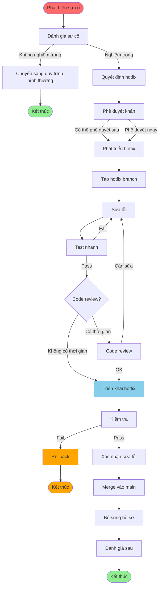

# QT-004: QUY TRÌNH HOTFIX

---

## 📋 THÔNG TIN TÀI LIỆU

- **Mã quy trình**: QT-004
- **Tên quy trình**: Quy trình Hotfix
- **Phiên bản**: 1.0
- **Ngày ban hành**: [Ngày hiện tại]
- **Người soạn**: 
- **Trạng thái**: Chính thức

---

## 📚 MỤC LỤC

1. [Tổng quan](#1-tổng-quan)
2. [Quy trình hotfix](#2-quy-trình-hotfix)
3. [Phân loại sự cố](#3-phân-loại-sự-cố)
4. [Quy trình phát triển hotfix](#4-quy-trình-phát-triển-hotfix)
5. [Quy trình triển khai hotfix](#5-quy-trình-triển-khai-hotfix)
6. [Quy trình hoàn thiện](#6-quy-trình-hoàn-thiện)
7. [Quy định về Quyền Truy Cập Tối Thiểu](#7-quy-định-về-quyền-truy-cập-tối-thiểu) ⭐
8. [Checklist](#8-checklist)

---

## 1. TỔNG QUAN

### 1.1. Mục đích

Quy trình hotfix nhằm xử lý nhanh chóng các sự cố nghiêm trọng trên Production bằng cách triển khai bản sửa lỗi khẩn cấp.

### 1.2. Phạm vi

- Áp dụng cho sự cố nghiêm trọng trên Production
- Sự cố ảnh hưởng đến dịch vụ, người dùng hoặc dữ liệu
- Cần xử lý khẩn cấp, không thể chờ quy trình bình thường

### 1.3. Đối tượng

- Development Team
- DevOps Team
- ECAB (Emergency Change Advisory Board)
- Lãnh đạo

---

## 2. QUY TRÌNH HOTFIX

### 2.1. Quy trình tổng quan



### 2.2. Chi tiết từng bước

#### Bước 1: Phát hiện sự cố

**Nguồn phát hiện**:
- Monitoring/Alerting
- Người dùng báo cáo
- Log analysis
- Team khác thông báo

**Công việc**:
- [ ] Ghi nhận sự cố
- [ ] Thu thập thông tin ban đầu
- [ ] Đánh giá mức độ nghiêm trọng

#### Bước 2: Đánh giá sự cố

**Công việc**:
- [ ] Xác định mức độ nghiêm trọng (xem Phần 3)
- [ ] Xác định nguyên nhân
- [ ] Quyết định có cần hotfix không

**Tiêu chí cần hotfix**:
- Sự cố nghiêm trọng (Critical/High)
- Ảnh hưởng đến dịch vụ, người dùng hoặc dữ liệu
- Cần xử lý ngay, không thể chờ quy trình bình thường

#### Bước 3: Phê duyệt khẩn

**Công việc**:
- [ ] Tạo Hotfix Request - Sử dụng template TP-002
- [ ] Gửi phê duyệt khẩn (ECAB/Lãnh đạo)
- [ ] Có thể phê duyệt sau nếu khẩn cấp

**Tham chiếu**: `TP-002-TEMPLATE_HOTFIX.md`

**Cấp phê duyệt**:
- **ECAB**: Sự cố nghiêm trọng
- **Lãnh đạo**: Sự cố rất nghiêm trọng

#### Bước 4: Phát triển hotfix

**Công việc**:
- [ ] Tạo hotfix branch
- [ ] Sửa lỗi
- [ ] Test nhanh
- [ ] Code review (nếu có thời gian)

**Tham chiếu**: Phần 4 - Quy trình phát triển hotfix

#### Bước 5: Triển khai hotfix

**Công việc**:
- [ ] Backup
- [ ] Deploy hotfix
- [ ] Kiểm tra
- [ ] Xác nhận sửa lỗi

**Tham chiếu**: Phần 5 - Quy trình triển khai hotfix

#### Bước 6: Hoàn thiện

**Công việc**:
- [ ] Merge vào main branch
- [ ] Bổ sung hồ sơ
- [ ] Đánh giá sau

**Tham chiếu**: Phần 6 - Quy trình hoàn thiện

---

## 3. PHÂN LOẠI SỰ CỐ

### 3.1. Mức độ nghiêm trọng

| Mức độ | Mô tả | Ví dụ | Thời gian xử lý |
|--------|-------|-------|-----------------|
| **Critical** | Hệ thống down, mất dữ liệu | Server crash, data loss | ≤ 1 giờ |
| **High** | Ảnh hưởng nghiêm trọng đến dịch vụ | API down, database issue | ≤ 4 giờ |
| **Medium** | Ảnh hưởng một phần dịch vụ | Performance issue, một số chức năng lỗi | ≤ 24 giờ |
| **Low** | Ảnh hưởng nhỏ | UI issue nhỏ, typo | Có thể chờ |

### 3.2. Tiêu chí cần hotfix

**Cần hotfix khi**:
- Mức độ Critical hoặc High
- Ảnh hưởng đến dịch vụ, người dùng hoặc dữ liệu
- Cần xử lý ngay, không thể chờ quy trình bình thường

**Không cần hotfix khi**:
- Mức độ Medium hoặc Low
- Có workaround
- Có thể chờ quy trình bình thường

---

## 4. QUY TRÌNH PHÁT TRIỂN HOTFIX

### 4.1. Tạo hotfix branch

**Quy tắc đặt tên**: `hotfix/vX.Y.Z` hoặc `hotfix/issue-XXX`

**Ví dụ**:
```bash
git checkout -b hotfix/v1.2.4
# hoặc
git checkout -b hotfix/issue-123
```

### 4.2. Sửa lỗi

**Nguyên tắc**:
- Sửa lỗi tối thiểu, chỉ sửa phần cần thiết
- Không thêm tính năng mới
- Không refactor không cần thiết
- Ghi comment rõ ràng

### 4.3. Test nhanh

**Các test cần thực hiện**:
- [ ] Unit test cho phần sửa
- [ ] Test case liên quan đến lỗi
- [ ] Smoke test cơ bản

**Lưu ý**: Test nhanh, tập trung vào phần sửa, không cần test đầy đủ như quy trình bình thường.

### 4.4. Code review

**Khi có thời gian**:
- Code review bởi ít nhất 1 người
- Review tập trung vào phần sửa
- Có thể review sau khi deploy (nếu khẩn cấp)

**Khi không có thời gian**:
- Có thể bỏ qua code review
- Review sau khi deploy
- Ghi nhận trong hồ sơ

---

## 5. QUY TRÌNH TRIỂN KHAI HOTFIX

### 5.1. Chuẩn bị triển khai

**Công việc**:
- [ ] Backup hệ thống
- [ ] Backup database
- [ ] Backup cấu hình
- [ ] Chuẩn bị rollback plan
- [ ] Thông báo team

### 5.2. Triển khai

**Công việc**:
- [ ] Deploy hotfix
- [ ] Kiểm tra deployment
- [ ] Kiểm tra service đã start
- [ ] Kiểm tra health check

### 5.3. Kiểm tra và xác nhận

**Công việc**:
- [ ] Kiểm tra log
- [ ] Test case liên quan đến lỗi
- [ ] Xác nhận sửa lỗi
- [ ] Giám sát hệ thống (ít nhất 30 phút)

### 5.4. Rollback (nếu cần)

**Khi nào rollback**:
- Hotfix không sửa được lỗi
- Hotfix gây ra lỗi mới
- Hotfix làm hệ thống không ổn định

**Quy trình rollback**: Tương tự QT-003 - Phần 7

---

## 6. QUY TRÌNH HOÀN THIỆN

### 6.1. Merge vào main branch

**Công việc**:
- [ ] Merge hotfix branch vào main
- [ ] Resolve conflicts (nếu có)
- [ ] Update version (nếu cần)
- [ ] Update CHANGELOG.md

**Lưu ý**: 
- Merge ngay sau khi hotfix đã được xác nhận thành công
- Không để hotfix branch tồn tại lâu

### 6.2. Bổ sung hồ sơ

**Công việc**:
- [ ] Bổ sung Hotfix Request (nếu chưa có)
- [ ] Ghi nhận trong changelog
- [ ] Update documentation (nếu cần)
- [ ] Ghi nhận trong issue tracker

**Thời hạn**: Trong vòng 1 tuần sau khi hotfix

### 6.3. Đánh giá sau

**Công việc**:
- [ ] Phân tích nguyên nhân sự cố
- [ ] Phân tích quy trình xử lý
- [ ] Đề xuất cải tiến
- [ ] Cập nhật runbook (nếu cần)
- [ ] Báo cáo

**Thời hạn**: Trong vòng 1 tuần sau khi hotfix

---

## 7. QUY ĐỊNH VỀ QUYỀN TRUY CẬP TỐI THIỂU

### 7.1. Nguyên tắc

- **Cấp quyền khẩn cấp**: Trong trường hợp hotfix, quyền có thể được cấp nhanh hơn nhưng vẫn phải tuân thủ nguyên tắc tối thiểu
- **Quyền tạm thời (JIT)**: Quyền cao chỉ được cấp tạm thời, tự động hết hạn sau khi hoàn thành hotfix
- **Ghi log đầy đủ**: Mọi hành động với quyền cao đều phải được ghi log
- **Phê duyệt sau**: Có thể phê duyệt nhanh qua chat/phone, nhưng phải ghi log và phê duyệt chính thức sau

### 7.2. Quyền truy cập trong hotfix

#### 7.2.1. Quyền truy cập Production

| Vai trò | Quyền | Điều kiện |
|---------|-------|-----------|
| **Developer** | Read (log only) | Xem log để debug |
| **DevOps** | Read/Write* | Sau khi có phê duyệt khẩn cấp |
| **DBA** | Read/Write* | Sau khi có phê duyệt khẩn cấp |

*Quyền tạm thời (JIT), tự động hết hạn sau 2-4 giờ

#### 7.2.2. Quyền deploy khẩn cấp

- **DevOps**: Được deploy lên Production sau khi có phê duyệt khẩn cấp
- **Developer**: Không được deploy trực tiếp, chỉ được hỗ trợ
- **DBA**: Được deploy database changes sau khi có phê duyệt khẩn cấp

#### 7.2.3. Quyền database khẩn cấp

- **Developer**: Read-only (chỉ xem log, không được query trực tiếp)
- **DevOps**: Read/Write* (theo quy trình, có log)
- **DBA**: Read/Write* (theo quy trình, có log)

*Quyền tạm thời (JIT), tự động hết hạn sau khi hoàn thành hotfix

### 7.3. Quy trình cấp quyền khẩn cấp cho hotfix

1. **Yêu cầu quyền**
   - Tạo yêu cầu trong hệ thống quản lý quyền
   - Mô tả lý do: Hotfix khẩn cấp
   - Xác định thời gian: 2-4 giờ

2. **Phê duyệt khẩn cấp**
   - PM/PDM hoặc ECAB phê duyệt nhanh qua chat/phone
   - Ghi log phê duyệt
   - Phê duyệt chính thức sau (trong vòng 24 giờ)

3. **Cấp quyền**
   - IT cấp quyền tạm thời (JIT) ngay lập tức
   - Tự động hết hạn sau 2-4 giờ
   - Ghi log đầy đủ

4. **Thu hồi quyền**
   - Tự động thu hồi sau khi hết hạn
   - Thu hồi ngay sau khi hoàn thành hotfix
   - Ghi log thu hồi

### 7.4. Giám sát và ghi log

- Mọi hành động với quyền cao đều được ghi log
- Log được lưu tối thiểu 90 ngày
- Rà soát log sau hotfix (trong vòng 1 tuần)
- Cảnh báo khi có hành động bất thường

**Tham chiếu**: 
- `CHÍNH SÁCH QUYỀN TRUY CẬP TỐI THIỂU.md` - Phần 12.5, 17.2
- `QUICK_REFERENCE_QUYEN_TRUY_CAP.md` - Tra cứu nhanh
- `TP-006-TEMPLATE_YEU_CAU_CAP_QUYEN.md` - Template yêu cầu cấp quyền

---

## 8. CHECKLIST

**Tham chiếu chi tiết**: `CL-003-CHECKLIST_HOTFIX.md`

### 7.1. Checklist phát hiện và đánh giá

- [ ] Sự cố đã được ghi nhận
- [ ] Mức độ nghiêm trọng đã được xác định
- [ ] Nguyên nhân đã được xác định
- [ ] Quyết định hotfix đã được thực hiện

### 7.2. Checklist phát triển hotfix

- [ ] Hotfix branch đã được tạo
- [ ] Lỗi đã được sửa
- [ ] Test nhanh đã pass
- [ ] Code review đã được thực hiện (nếu có thời gian)

### 7.3. Checklist triển khai hotfix

- [ ] Backup đã được thực hiện
- [ ] Hotfix đã được deploy
- [ ] Deployment đã được kiểm tra
- [ ] Lỗi đã được xác nhận sửa

### 7.4. Checklist hoàn thiện

- [ ] Hotfix đã được merge vào main
- [ ] Hồ sơ đã được bổ sung
- [ ] Đánh giá sau đã được thực hiện

---

**Phiên bản**: 1.0
**Ngày ban hành**: [Ngày hiện tại]
**Người soạn**: 
**Trạng thái**: Chính thức

