# QT-005: QUY TRÌNH PROVISIONING

---

## 📋 THÔNG TIN TÀI LIỆU

- **Mã quy trình**: QT-005
- **Tên quy trình**: Quy trình Provisioning
- **Phiên bản**: 1.0
- **Ngày ban hành**: [Ngày hiện tại]
- **Người soạn**: 
- **Trạng thái**: Chính thức

---

## 📚 MỤC LỤC

1. [Tổng quan](#1-tổng-quan)
2. [Quy trình provisioning](#2-quy-trình-provisioning)
3. [Các loại tài nguyên](#3-các-loại-tài-nguyên)
4. [Thiết kế và cấu hình](#4-thiết-kế-và-cấu-hình)
5. [Kiểm thử và bàn giao](#5-kiểm-thử-và-bàn-giao)
6. [Quy định về Quyền Truy Cập Tối Thiểu](#6-quy-định-về-quyền-truy-cập-tối-thiểu) ⭐
7. [Checklist](#7-checklist)

---

## 1. TỔNG QUAN

### 1.1. Mục đích

Quy trình provisioning nhằm cung cấp và cấu hình tài nguyên hệ thống một cách có kiểm soát, đảm bảo an toàn và hiệu quả.

### 1.2. Phạm vi

- Cung cấp server, database, network, storage
- Cấu hình hệ thống, bảo mật, monitoring
- Áp dụng cho môi trường Production, DR, UAT, Staging

### 1.3. Đối tượng

- DevOps Team
- Infrastructure Team
- Development Team
- PM/PDM

---

## 2. QUY TRÌNH PROVISIONING

### 2.1. Quy trình tổng quan

```mermaid
flowchart TD
    Start([Yêu cầu provisioning]) --> Request[Tạo Provisioning Request]
    
    Request --> Approve[Phê duyệt]
    
    Approve -->|Chưa phê duyệt| Wait[Chờ phê duyệt]
    Wait --> Approve
    
    Approve -->|Đã phê duyệt| Design[Thiết kế]
    
    Design --> ReviewDesign[Review thiết kế]
    
    ReviewDesign -->|Cần sửa| Design
    
    ReviewDesign -->|OK| Allocate[Phân bổ tài nguyên]
    
    Allocate --> Create[Tạo tài nguyên]
    
    Create --> ConfigSystem[Cấu hình hệ thống]
    
    ConfigSystem --> ConfigNetwork[Cấu hình mạng]
    
    ConfigNetwork --> ConfigSecurity[Cấu hình bảo mật]
    
    ConfigSecurity --> ConfigApp[Cấu hình ứng dụng]
    
    ConfigApp --> ConfigDB[Cấu hình database]
    
    ConfigDB --> ConfigMonitor[Cấu hình monitoring]
    
    ConfigMonitor --> ConfigBackup[Cấu hình backup]
    
    ConfigBackup --> Test[Kiểm thử]
    
    Test -->|Fail| Fix[Sửa lỗi]
    Fix --> Test
    
    Test -->|Pass| Document[Tài liệu hóa]
    
    Document --> Handover[Bàn giao]
    
    Handover --> Record[Ghi nhận]
    
    Record --> End([Kết thúc])
    
    style Start fill:#90EE90
    style End fill:#FFB6C1
    style Approve fill:#87CEEB
    style Test fill:#FFD700
```

### 2.2. Chi tiết từng bước

#### Bước 1: Yêu cầu

**Công việc**:
- [ ] Tạo Provisioning Request - Sử dụng template TP-004
- [ ] Mô tả yêu cầu chi tiết
- [ ] Xác định môi trường (Production/DR/UAT/Staging)
- [ ] Xác định loại tài nguyên cần
- [ ] Xác định thời gian cần

**Tham chiếu**: `TP-004-TEMPLATE_PROVISIONING.md`

#### Bước 2: Phê duyệt

**Công việc**:
- [ ] Đánh giá yêu cầu
- [ ] Kiểm tra tài nguyên có sẵn
- [ ] Phê duyệt
- [ ] Phân bổ tài nguyên

**Cấp phê duyệt**:
- **PM/PDM**: Tài nguyên nhỏ, môi trường Staging/UAT
- **Ban CLGSP**: Tài nguyên trung bình, môi trường Production
- **Lãnh đạo**: Tài nguyên lớn, chi phí cao

#### Bước 3: Thiết kế

**Công việc**:
- [ ] Thiết kế kiến trúc
- [ ] Thiết kế cấu hình
- [ ] Thiết kế bảo mật
- [ ] Thiết kế network
- [ ] Review thiết kế

**Tham chiếu**: Phần 4 - Thiết kế và cấu hình

#### Bước 4: Cung cấp

**Công việc**:
- [ ] Tạo tài nguyên
- [ ] Cấu hình hệ thống
- [ ] Cấu hình mạng
- [ ] Cấu hình bảo mật

#### Bước 5: Cấu hình

**Công việc**:
- [ ] Cấu hình ứng dụng
- [ ] Cấu hình database
- [ ] Cấu hình monitoring
- [ ] Cấu hình backup

#### Bước 6: Kiểm thử

**Công việc**:
- [ ] Test kết nối
- [ ] Test chức năng
- [ ] Test performance
- [ ] Test bảo mật

**Tham chiếu**: Phần 5 - Kiểm thử và bàn giao

#### Bước 7: Bàn giao

**Công việc**:
- [ ] Tài liệu hóa
- [ ] Bàn giao cho team
- [ ] Ghi nhận

---

## 3. CÁC LOẠI TÀI NGUYÊN

### 3.1. Server

#### 3.1.1. Loại server

- **Application Server**: Chạy ứng dụng
- **Web Server**: Phục vụ web
- **Database Server**: Chạy database
- **Cache Server**: Chạy cache (Redis, Memcached)
- **Message Queue Server**: Chạy message queue (RabbitMQ, Kafka)

#### 3.1.2. Yêu cầu

- **OS**: Linux (Ubuntu, CentOS, ...)
- **CPU**: Số core, loại CPU
- **Memory**: Dung lượng RAM
- **Disk**: Dung lượng disk, loại disk (SSD/HDD)
- **Network**: Băng thông, IP

### 3.2. Database

#### 3.2.1. Loại database

- **Relational Database**: MySQL, PostgreSQL, Oracle
- **NoSQL Database**: MongoDB, Cassandra
- **In-memory Database**: Redis

#### 3.2.2. Yêu cầu

- **Version**: Phiên bản database
- **Storage**: Dung lượng lưu trữ
- **Backup**: Chính sách backup
- **Replication**: Cấu hình replication (nếu cần)
- **High Availability**: Cấu hình HA (nếu cần)

### 3.3. Network

#### 3.3.1. Các thành phần

- **VPC/VLAN**: Virtual network
- **Subnet**: Mạng con
- **Security Group/Firewall**: Bảo mật mạng
- **Load Balancer**: Cân bằng tải
- **DNS**: Phân giải tên miền

#### 3.3.2. Yêu cầu

- **IP Range**: Dải IP
- **Port**: Các port cần mở
- **Bandwidth**: Băng thông
- **Security**: Quy tắc bảo mật

### 3.4. Storage

#### 3.4.1. Loại storage

- **Block Storage**: Disk volume
- **Object Storage**: S3, MinIO
- **File Storage**: NFS, CIFS

#### 3.4.2. Yêu cầu

- **Capacity**: Dung lượng
- **Performance**: IOPS, throughput
- **Backup**: Chính sách backup
- **Encryption**: Mã hóa (nếu cần)

### 3.5. Monitoring và Logging

#### 3.5.1. Các thành phần

- **Monitoring**: Prometheus, Grafana, Zabbix
- **Logging**: ELK, Loki
- **Alerting**: AlertManager, PagerDuty

#### 3.5.2. Yêu cầu

- **Metrics**: Các metrics cần giám sát
- **Alerts**: Các cảnh báo cần thiết
- **Retention**: Thời gian lưu trữ

---

## 4. THIẾT KẾ VÀ CẤU HÌNH

### 4.1. Thiết kế kiến trúc

#### 4.1.1. Yêu cầu

- **High Availability**: Đảm bảo tính sẵn sàng cao
- **Scalability**: Khả năng mở rộng
- **Security**: Bảo mật
- **Performance**: Hiệu năng
- **Cost**: Chi phí

#### 4.1.2. Nội dung thiết kế

- Sơ đồ kiến trúc
- Sơ đồ mạng
- Sơ đồ bảo mật
- Kế hoạch mở rộng

### 4.2. Thiết kế cấu hình

#### 4.2.1. Cấu hình hệ thống

- OS configuration
- System parameters
- Resource limits
- Security settings

#### 4.2.2. Cấu hình ứng dụng

- Application configuration
- Environment variables
- Feature flags
- API endpoints

#### 4.2.3. Cấu hình database

- Database configuration
- Connection pool
- Query optimization
- Index strategy

### 4.3. Thiết kế bảo mật

#### 4.3.1. Network security

- Firewall rules
- Security groups
- Network segmentation
- VPN/Private network

#### 4.3.2. Access control

- User accounts
- SSH keys
- API keys
- Certificates

#### 4.3.3. Data security

- Encryption at rest
- Encryption in transit
- Backup encryption
- Access logging

### 4.4. Review thiết kế

**Công việc**:
- [ ] Review bởi Infrastructure Team
- [ ] Review bởi Security Team
- [ ] Review bởi Development Team
- [ ] Phê duyệt thiết kế

---

## 5. KIỂM THỬ VÀ BÀN GIAO

### 5.1. Kiểm thử

#### 5.1.1. Test kết nối

- [ ] Test SSH/RDP
- [ ] Test network connectivity
- [ ] Test database connection
- [ ] Test API endpoints

#### 5.1.2. Test chức năng

- [ ] Test ứng dụng hoạt động
- [ ] Test database operations
- [ ] Test backup/restore
- [ ] Test monitoring

#### 5.1.3. Test performance

- [ ] Test load
- [ ] Test response time
- [ ] Test throughput
- [ ] Test resource usage

#### 5.1.4. Test bảo mật

- [ ] Test firewall rules
- [ ] Test access control
- [ ] Test encryption
- [ ] Test vulnerability scan

### 5.2. Tài liệu hóa

#### 5.2.1. Nội dung tài liệu

- Kiến trúc hệ thống
- Cấu hình chi tiết
- Thông tin kết nối
- Credentials (lưu trong secret management)
- Runbook
- Contact information

#### 5.2.2. Lưu trữ tài liệu

- Wiki/Confluence
- Version control
- Secret management (cho credentials)

### 5.3. Bàn giao

#### 5.3.1. Công việc

- [ ] Bàn giao cho Development Team
- [ ] Bàn giao cho DevOps Team
- [ ] Training (nếu cần)
- [ ] Ghi nhận bàn giao

#### 5.3.2. Nội dung bàn giao

- Tài liệu hệ thống
- Credentials
- Access information
- Runbook
- Contact information

---

## 6. QUY ĐỊNH VỀ QUYỀN TRUY CẬP TỐI THIỂU

### 6.1. Nguyên tắc

- **Cấp đúng quyền – đủ quyền – chỉ quyền cần thiết**: Mỗi người dùng chỉ được cấp quyền đủ để tạo và cấu hình tài nguyên
- **Phân quyền theo vai trò (RBAC)**: Tất cả quyền được cấp thông qua Role
- **Cấp quyền tạm thời (JIT)**: Quyền cao chỉ được cấp khi có yêu cầu chính đáng, tự động hết hạn sau khi hoàn thành provisioning

### 6.2. Quyền truy cập trong provisioning

#### 6.2.1. Quyền tạo tài nguyên

| Vai trò | Server | Database | Network | Storage |
|---------|--------|----------|---------|---------|
| **Developer** | ❌ | ❌ | ❌ | ❌ |
| **DevOps** | ✅* | ✅* | ✅* | ✅* |
| **Infrastructure** | ✅* | ✅* | ✅* | ✅* |
| **DBA** | ❌ | ✅* | ❌ | ❌ |

*Sau khi có phê duyệt

#### 6.2.2. Quyền cấu hình tài nguyên

| Vai trò | Server Config | DB Config | Network Config | Security Config |
|---------|---------------|-----------|----------------|-----------------|
| **Developer** | ❌ | ❌ | ❌ | ❌ |
| **DevOps** | ✅* | ✅* | ✅* | ✅* |
| **Infrastructure** | ✅* | ✅* | ✅* | ✅* |
| **DBA** | ❌ | ✅* | ❌ | ❌ |

*Sau khi có phê duyệt

#### 6.2.3. Quyền truy cập tài nguyên sau khi tạo

- **Developer**: Read-only (chỉ xem, không được modify)
- **DevOps**: Read/Write (có thể modify)
- **Infrastructure**: Read/Write (có thể modify)
- **DBA**: Read/Write trên database (có thể modify)

### 6.3. Quy trình cấp quyền cho provisioning

1. **Yêu cầu quyền**
   - Tạo yêu cầu trong hệ thống quản lý quyền
   - Mô tả lý do: Tạo tài nguyên mới
   - Xác định loại tài nguyên và quyền cần
   - Xác định thời gian: Vĩnh viễn hoặc tạm thời

2. **Phê duyệt**
   - PM/PDM phê duyệt cho quyền Level 1.0-2.0
   - Ban CLGSP phê duyệt cho quyền Level 3.0
   - Lãnh đạo phê duyệt cho quyền Level 4.0

3. **Cấp quyền**
   - IT cấp quyền theo role
   - Cấp quyền cho tài nguyên cụ thể
   - Ghi log đầy đủ

4. **Thu hồi quyền**
   - Thu hồi quyền khi không còn cần
   - Thu hồi quyền khi tài nguyên bị xóa
   - Ghi log thu hồi

### 6.4. Giám sát và ghi log

- Mọi hành động tạo/cấu hình tài nguyên đều được ghi log
- Log được lưu tối thiểu 90 ngày
- Rà soát log định kỳ (hàng tháng)
- Cảnh báo khi có hành động bất thường

**Tham chiếu**: 
- `CHÍNH SÁCH QUYỀN TRUY CẬP TỐI THIỂU.md` - Phần 4, 5, 6, 13
- `QUICK_REFERENCE_QUYEN_TRUY_CAP.md` - Tra cứu nhanh
- `TP-006-TEMPLATE_YEU_CAU_CAP_QUYEN.md` - Template yêu cầu cấp quyền

---

## 7. CHECKLIST

**Tham chiếu chi tiết**: `CL-004-CHECKLIST_PROVISIONING.md`

### 7.1. Checklist yêu cầu

- [ ] Provisioning Request đã được tạo
- [ ] Yêu cầu đã được mô tả chi tiết
- [ ] Môi trường đã được xác định
- [ ] Loại tài nguyên đã được xác định

### 7.2. Checklist thiết kế

- [ ] Kiến trúc đã được thiết kế
- [ ] Cấu hình đã được thiết kế
- [ ] Bảo mật đã được thiết kế
- [ ] Thiết kế đã được review và phê duyệt

### 7.3. Checklist cung cấp

- [ ] Tài nguyên đã được tạo
- [ ] Hệ thống đã được cấu hình
- [ ] Mạng đã được cấu hình
- [ ] Bảo mật đã được cấu hình

### 7.4. Checklist cấu hình

- [ ] Ứng dụng đã được cấu hình
- [ ] Database đã được cấu hình
- [ ] Monitoring đã được cấu hình
- [ ] Backup đã được cấu hình

### 7.5. Checklist kiểm thử

- [ ] Test kết nối đã pass
- [ ] Test chức năng đã pass
- [ ] Test performance đã pass
- [ ] Test bảo mật đã pass

### 7.6. Checklist bàn giao

- [ ] Tài liệu đã được tạo
- [ ] Bàn giao đã được thực hiện
- [ ] Ghi nhận đã được thực hiện

---

**Phiên bản**: 1.0
**Ngày ban hành**: [Ngày hiện tại]
**Người soạn**:
**Trạng thái**: Chính thức

