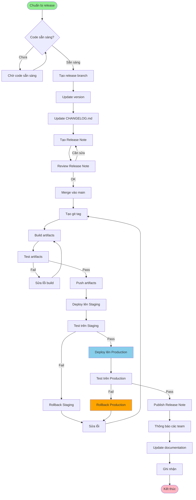

# QT-007: QUY TRÌNH RELEASE SẢN PHẨM

---

## 📋 THÔNG TIN TÀI LIỆU

- **Mã quy trình**: QT-007
- **Tên quy trình**: Quy trình Release Sản phẩm
- **Phiên bản**: 1.0
- **Ngày ban hành**: [Ngày hiện tại]
- **Người soạn**:
- **Trạng thái**: Chính thức

---

## 📚 MỤC LỤC

1. [Tổng quan](#1-tổng-quan)
2. [Quy trình release](#2-quy-trình-release)
3. [Chuẩn bị release](#3-chuẩn-bị-release)
4. [Tạo release](#4-tạo-release)
5. [Deploy release](#5-deploy-release)
6. [Publish release](#6-publish-release)
7. [Release Note](#7-release-note)
8. [Quy định về Quyền Truy Cập Tối Thiểu](#8-quy-định-về-quyền-truy-cập-tối-thiểu) ⭐
9. [Checklist](#9-checklist)

---

## 1. TỔNG QUAN

### 1.1. Mục đích

Quy trình release sản phẩm nhằm phát hành phiên bản sản phẩm mới một cách có kiểm soát, đảm bảo chất lượng và thông báo đầy đủ.

### 1.2. Phạm vi

- Release code, documentation, và thông báo
- Áp dụng cho tất cả sản phẩm
- Áp dụng cho môi trường Production, DR

### 1.3. Đối tượng

- Development Team
- DevOps Team
- QA Team
- PM/PDM
- Product Owner

---

## 2. QUY TRÌNH RELEASE

### 2.1. Quy trình tổng quan



### 2.2. Chi tiết từng bước

#### Bước 1: Chuẩn bị release

**Công việc**:
- [ ] Code đã sẵn sàng
- [ ] Tests đã pass
- [ ] Documentation đã update
- [ ] Version đã được xác định

**Tham chiếu**: Phần 3 - Chuẩn bị release

#### Bước 2: Tạo release branch

**Công việc**:
- [ ] Tạo branch: `release/vX.Y.Z`
- [ ] Update version
- [ ] Update CHANGELOG.md

**Tham chiếu**: QT-006 - Versioning

#### Bước 3: Tạo Release Note

**Công việc**:
- [ ] Thu thập thông tin
- [ ] Viết Release Note
- [ ] Review Release Note

**Tham chiếu**: Phần 7 - Release Note

#### Bước 4: Tạo release

**Công việc**:
- [ ] Merge vào main
- [ ] Tạo git tag
- [ ] Build artifacts
- [ ] Push artifacts

**Tham chiếu**: Phần 4 - Tạo release

#### Bước 5: Deploy

**Công việc**:
- [ ] Deploy lên Staging
- [ ] Test trên Staging
- [ ] Deploy lên Production
- [ ] Test trên Production

**Tham chiếu**: Phần 5 - Deploy release, QT-003 - Upcode

#### Bước 6: Publish

**Công việc**:
- [ ] Publish Release Note
- [ ] Thông báo các team
- [ ] Update documentation
- [ ] Ghi nhận

**Tham chiếu**: Phần 6 - Publish release

---

## 3. CHUẨN BỊ RELEASE

### 3.1. Điều kiện release

**Code sẵn sàng**:
- [ ] Code đã được review và merge
- [ ] Tất cả tests đã pass
- [ ] Code coverage: ≥ 80%
- [ ] Security scan: Pass
- [ ] Performance tests: Pass (nếu cần)

**Documentation**:
- [ ] API documentation đã được update
- [ ] User guide đã được update (nếu cần)
- [ ] CHANGELOG.md đã được update

**Version**:
- [ ] Version đã được xác định (theo QT-006)
- [ ] Version đã được update trong code

### 3.2. Checklist chuẩn bị

- [ ] Code đã sẵn sàng
- [ ] Tests đã pass
- [ ] Documentation đã update
- [ ] Version đã được xác định
- [ ] Release Note draft đã được tạo
- [ ] Không có blocking issues

---

## 4. TẠO RELEASE

### 4.1. Tạo release branch

**Quy tắc đặt tên**: `release/vX.Y.Z`

**Ví dụ**:
```bash
git checkout main
git pull origin main
git checkout -b release/v1.2.3
```

### 4.2. Update version

**Công việc**:
- [ ] Update version trong code (theo QT-006)
- [ ] Update CHANGELOG.md
  - Di chuyển các thay đổi từ `[Unreleased]` sang version mới
  - Thêm ngày release: `## [X.Y.Z] - YYYY-MM-DD`
  - Sắp xếp theo loại: Added, Changed, Fixed, Security, etc.
  - **Tham chiếu**: `Hỗ trợ (Support)/HUONG_DAN_CHANGELOG.md` - Hướng dẫn chi tiết về CHANGELOG.md
- [ ] Commit changes

### 4.3. Merge vào main

**Công việc**:
```bash
git checkout main
git merge release/v1.2.3
git push origin main
```

### 4.4. Tạo git tag

**Công việc**:
```bash
git tag -a v1.2.3 -m "Release v1.2.3"
git push origin v1.2.3
```

**Tham chiếu**: QT-006 - Git tagging

### 4.5. Build artifacts

**Công việc**:
- [ ] Build Docker image
- [ ] Build binary (nếu có)
- [ ] Build documentation
- [ ] Test artifacts

**Ví dụ Docker**:
```bash
docker build -t my-service:1.2.3 .
docker build -t my-service:latest .
docker push my-service:1.2.3
docker push my-service:latest
```

### 4.6. Push artifacts

**Công việc**:
- [ ] Push Docker image lên registry
- [ ] Push binary lên storage (nếu có)
- [ ] Push documentation (nếu có)

---

## 5. DEPLOY RELEASE

### 5.1. Deploy lên Staging

**Công việc**:
- [ ] Deploy Docker image lên Staging
- [ ] Verify deployment
- [ ] Smoke test
- [ ] Test các tính năng mới

**Tham chiếu**: QT-003 - Upcode

### 5.2. Test trên Staging

**Công việc**:
- [ ] Chạy test suite
- [ ] Test các tính năng mới
- [ ] Test integration với các service khác
- [ ] Test performance (nếu cần)

**Checklist**:
- [ ] Unit tests: Pass
- [ ] Integration tests: Pass
- [ ] E2E tests: Pass
- [ ] Performance tests: Pass (nếu cần)
- [ ] Không có regression

### 5.3. Deploy lên Production

**Công việc**:
- [ ] Deploy Docker image lên Production
- [ ] Verify deployment
- [ ] Smoke test
- [ ] Giám sát hệ thống

**Tham chiếu**: QT-003 - Upcode

### 5.4. Test trên Production

**Công việc**:
- [ ] Smoke test
- [ ] Giám sát hệ thống (ít nhất 1 giờ)
- [ ] Kiểm tra log
- [ ] Kiểm tra metrics

**Checklist**:
- [ ] Smoke tests: Pass
- [ ] Không có lỗi trong log
- [ ] Metrics trong giới hạn cho phép
- [ ] Monitoring không có cảnh báo

---

## 6. PUBLISH RELEASE

### 6.1. Publish Release Note

**Công việc**:
- [ ] Publish Release Note trên documentation site
- [ ] Publish Release Note trên GitHub/GitLab release page
- [ ] Update changelog

**Tham chiếu**: Phần 7 - Release Note

### 6.2. Thông báo các team

**Công việc**:
- [ ] Thông báo Development Team
- [ ] Thông báo DevOps Team
- [ ] Thông báo QA Team
- [ ] Thông báo Product Owner
- [ ] Thông báo người dùng (nếu cần)

**Kênh thông báo**:
- Email
- Slack/Teams
- JIRA
- Wiki

### 6.3. Update documentation

**Công việc**:
- [ ] Update API documentation
- [ ] Update user guide (nếu cần)
- [ ] Update deployment guide (nếu cần)
- [ ] Update runbook (nếu cần)

### 6.4. Ghi nhận

**Công việc**:
- [ ] Ghi nhận release trong JIRA
- [ ] Ghi nhận trong changelog
- [ ] Ghi nhận trong release history

---

## 7. RELEASE NOTE

### 7.1. Tổng quan

Release Note là tài liệu mô tả các thay đổi trong một phiên bản release. Template mới được tối ưu cho quy trình Agile, gọn gàng và tập trung vào thông tin cần thiết.

**Tham chiếu**: `TP-003-TEMPLATE_RELEASE_NOTE.md` (v2.0 - Agile Release Note)

### 7.2. Nội dung Release Note

#### 7.2.1. Thông tin Release

- Service Name
- Version (SemVer: X.Y.Z)
- Release Date (với giờ)
- Release Type (Major/Minor/Patch)
- Previous Version

#### 7.2.2. Version Information ⭐ MỚI

**Git Version**:
- Git Tag (ví dụ: `v1.2.3`)
- Git Commit (commit hash)
- Git Branch (ví dụ: `main`, `release/v1.2.3`)
- Compare link (link so sánh với version trước)

**Docker Image**:
- Image Name (registry/namespace/service-name)
- Image Tag (ví dụ: `v1.2.3`)
- Image Digest (sha256 digest) ⭐ **Khuyến nghị sử dụng cho production**
- Full Image (image với tag và digest)

**Ví dụ**:
```bash
# Pull với tag
docker pull registry.example.com/myorg/user-service:v1.2.3

# Pull với digest (khuyến nghị cho production)
docker pull registry.example.com/myorg/user-service:v1.2.3@sha256:abc123...
```

#### 7.2.3. Nội dung chính

- **Tóm tắt**: Mô tả ngắn gọn và highlights
- **Breaking Changes**: Nếu có, đặt ở đầu và làm nổi bật
- **Tính năng mới (Features)**: Liệt kê với issue/PR links
- **Sửa lỗi (Bug Fixes)**: Liệt kê với issue/PR links
- **Cải tiến (Improvements)**: Mô tả ngắn gọn
- **Bảo mật (Security)**: CVE và severity nếu có
- **Dependencies**: Updated/Added/Removed

#### 7.2.4. Upgrade Instructions ⭐ MỚI

- Hướng dẫn upgrade cho Docker/Kubernetes
- Hướng dẫn upgrade cho Docker Compose
- Ví dụ commands cụ thể

#### 7.2.5. Testing Results (Kiến nghị) ⭐

> **💡 Lưu ý**: Phần này là kiến nghị, điền nếu có thông tin test quan trọng hoặc cần thiết.

- Unit Tests (coverage %, pass/fail)
- Integration Tests
- E2E Tests
- Load Tests (nếu có)
- Security Tests (nếu có)
- Performance Tests (nếu có)
- Ghi chú về testing

#### 7.2.6. Performance Metrics (Kiến nghị) ⭐

> **💡 Lưu ý**: Phần này là kiến nghị, điền nếu có cải thiện performance đáng kể hoặc cần lưu ý.

- Response Time (trước/sau, % thay đổi)
- Throughput (trước/sau, % thay đổi)
- Memory Usage (trước/sau, % thay đổi)
- CPU Usage (trước/sau, % thay đổi)
- Database Query Time (nếu có)
- Ghi chú về performance

#### 7.2.7. Thông tin bổ sung

- Links (Full Changelog, Documentation, API Docs, Migration Guide)
- Contributors
- Release Manager, Reviewed By, Approved By

### 7.3. Quy trình tạo Release Note

```
1. Thu thập thông tin
   → Từ commit messages
   → Từ pull requests
   → Từ issue tracker
   → Từ development team
   → Git tag và commit hash
   → Docker image tag và digest

2. Viết Release Note
   → Sử dụng template TP-003 (v2.0 - Agile)
   → Điền đầy đủ thông tin Git Version
   → Điền đầy đủ thông tin Docker Image (bao gồm digest)
   → Mô tả ngắn gọn, rõ ràng các thay đổi
   → Liệt kê breaking changes (nếu có)
   → Thêm upgrade instructions

3. Review
   → Review bởi development team
   → Review bởi product owner
   → Review bởi QA team
   → Verify Git tag và Docker image thông tin

4. Publish
   → Publish trên documentation site
   → Publish trên GitHub/GitLab release page
   → Đảm bảo Docker image đã được push với đúng tag và digest
```

### 7.4. Lưu ý quan trọng

#### 7.4.1. Git Version

- **Luôn ghi lại Git tag**: Để dễ dàng trace lại code của release
- **Ghi lại commit hash**: Để xác định chính xác commit được release
- **Compare link**: Giúp xem tất cả thay đổi so với version trước

#### 7.4.2. Docker Image

- **Sử dụng digest cho production**: Digest đảm bảo image không thay đổi, ngay cả khi tag bị overwrite
- **Ghi lại cả tag và digest**: Tag dễ nhớ, digest đảm bảo an toàn
- **Verify image trước khi publish**: Đảm bảo image đã được push và có thể pull được

**Ví dụ lấy digest**:
```bash
# Lấy digest của image
docker inspect registry.example.com/myorg/user-service:v1.2.3 | grep -i digest

# Hoặc khi pull
docker pull registry.example.com/myorg/user-service:v1.2.3
# Output sẽ có dòng: Digest: sha256:abc123...
```

### 7.5. Timeline

- **Release Note draft**: 2 ngày trước release
- **Review**: 1 ngày trước release
- **Publish**: Cùng lúc với release
- **Verify Git/Docker info**: Trước khi publish

---

## 8. QUY ĐỊNH VỀ QUYỀN TRUY CẬP TỐI THIỂU

### 8.1. Nguyên tắc

- **Cấp đúng quyền – đủ quyền – chỉ quyền cần thiết**: Mỗi người dùng chỉ được cấp quyền đủ để hoàn thành nhiệm vụ release
- **Phân quyền theo vai trò (RBAC)**: Tất cả quyền được cấp thông qua Role
- **Cấp quyền tạm thời (JIT)**: Quyền cao chỉ được cấp khi có yêu cầu chính đáng, tự động hết hạn sau khi hoàn thành release

### 8.2. Quyền truy cập trong release

#### 8.2.1. Quyền tạo release

| Vai trò | Quyền | Điều kiện |
|---------|-------|-----------|
| **Developer** | ❌ Không được tạo release | Chỉ được đề xuất |
| **DevOps** | ✅ Tạo release | Sau khi có phê duyệt |
| **PM/PDM** | ✅ Tạo release | Sau khi có phê duyệt |
| **Product Owner** | ✅ Tạo release | Sau khi có phê duyệt |

#### 8.2.2. Quyền publish release

| Vai trò | Quyền | Điều kiện |
|---------|-------|-----------|
| **Developer** | ❌ Không được publish | Chỉ được đề xuất |
| **DevOps** | ✅ Publish release | Sau khi có phê duyệt |
| **PM/PDM** | ✅ Publish release | Sau khi có phê duyệt |
| **Product Owner** | ✅ Publish release | Sau khi có phê duyệt |

#### 8.2.3. Quyền deploy release

- **Developer**: Không được deploy trực tiếp lên Production/DR
- **DevOps**: Được deploy lên Production/DR sau khi có phê duyệt (theo QT-003)
- **QA**: Không được deploy, chỉ được test

#### 8.2.4. Quyền truy cập release artifacts

- **Developer**: Read-only (chỉ xem, không được modify)
- **DevOps**: Read/Write (có thể modify artifacts)
- **PM/PDM**: Read-only (chỉ xem)
- **QA**: Read-only (chỉ xem để test)

### 8.3. Quy trình cấp quyền tạm thời cho release

1. **Yêu cầu quyền**
   - Tạo yêu cầu trong hệ thống quản lý quyền
   - Mô tả lý do: Release sản phẩm
   - Xác định thời gian: 1-2 giờ

2. **Phê duyệt**
   - PM/PDM phê duyệt cho quyền Level 1.0-2.0
   - Ban CLGSP phê duyệt cho quyền Level 3.0
   - Lãnh đạo phê duyệt cho quyền Level 4.0

3. **Cấp quyền**
   - IT cấp quyền theo role
   - Tự động hết hạn sau thời gian quy định
   - Ghi log đầy đủ

4. **Thu hồi quyền**
   - Tự động thu hồi sau khi hết hạn
   - Thu hồi ngay sau khi hoàn thành release
   - Ghi log thu hồi

### 8.4. Giám sát và ghi log

- Mọi hành động với quyền cao đều được ghi log
- Log được lưu tối thiểu 90 ngày
- Rà soát log định kỳ (hàng tháng)
- Cảnh báo khi có hành động bất thường

**Tham chiếu**: 
- `CHÍNH SÁCH QUYỀN TRUY CẬP TỐI THIỂU.md` - Phần 12, 13, 14
- `QUICK_REFERENCE_QUYEN_TRUY_CAP.md` - Tra cứu nhanh
- `TP-006-TEMPLATE_YEU_CAU_CAP_QUYEN.md` - Template yêu cầu cấp quyền

---

## 9. CHECKLIST

**Tham chiếu chi tiết**: `CL-005-CHECKLIST_RELEASE.md`

### 9.1. Checklist chuẩn bị release

- [ ] Code đã được review và merge
- [ ] Tất cả tests đã pass
- [ ] Documentation đã được update
- [ ] Version đã được xác định
- [ ] Release Note draft đã được tạo
- [ ] Release Note đã được review
- [ ] Không có blocking issues

### 9.2. Checklist tạo release

- [ ] Release branch đã được tạo
- [ ] Version đã được update
- [ ] CHANGELOG.md đã được update
- [ ] Release branch đã được merge vào main
- [ ] Git tag đã được tạo
- [ ] Artifacts đã được build
- [ ] Artifacts đã được test
- [ ] Artifacts đã được push

### 9.3. Checklist deploy release

- [ ] Deploy lên Staging thành công
- [ ] Test trên Staging thành công
- [ ] Deploy lên Production thành công
- [ ] Test trên Production thành công
- [ ] Giám sát hệ thống không có vấn đề

### 9.4. Checklist publish release

- [ ] Release Note đã được publish
- [ ] Documentation đã được update
- [ ] Các team liên quan đã được thông báo
- [ ] Release đã được ghi nhận

---

**Phiên bản**: 1.0
**Ngày ban hành**: [Ngày hiện tại]
**Người soạn**: 
**Trạng thái**: Chính thức

