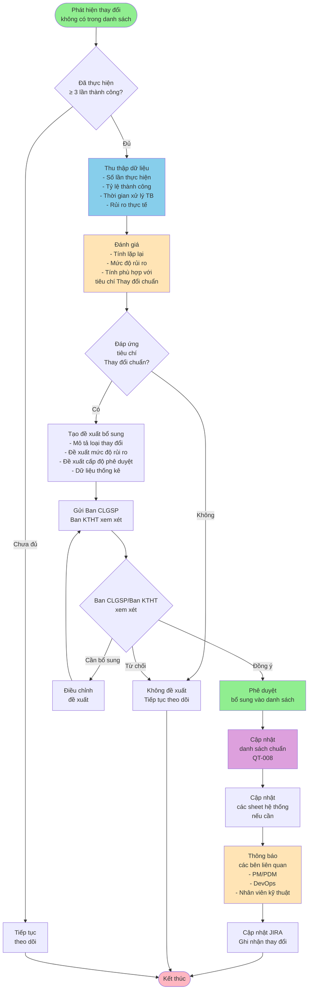

# QT-009: QUY TRÌNH BỔ SUNG THAY ĐỔI VÀO DANH SÁCH CHUẨN

---

## 📋 THÔNG TIN TÀI LIỆU

- **Mã quy trình**: QT-009
- **Tên quy trình**: Quy trình Bổ sung Thay đổi vào Danh sách Chuẩn
- **Phiên bản**: 1.0
- **Ngày ban hành**: [Ngày hiện tại]
- **Người soạn**: 
- **Trạng thái**: Chính thức

---

## 📚 MỤC LỤC

1. [Tổng quan](#1-tổng-quan)
2. [Quy trình bổ sung](#2-quy-trình-bổ-sung)
3. [Tiêu chí đánh giá](#3-tiêu-chí-đánh-giá)
4. [Quy trình phê duyệt](#4-quy-trình-phê-duyệt)
5. [Template đề xuất](#5-template-đề-xuất)
6. [Checklist](#6-checklist)

---

## 1. TỔNG QUAN

### 1.1. Mục đích

Quy trình này quy định cách thức đề xuất và bổ sung các loại thay đổi mới vào danh sách thay đổi chuẩn (QT-008), đảm bảo danh sách được cập nhật và mở rộng một cách có hệ thống.

### 1.2. Phạm vi

- Áp dụng cho các loại thay đổi không có trong danh sách chuẩn hiện tại
- Áp dụng cho các loại thay đổi đã được thực hiện nhiều lần thành công
- Áp dụng cho việc cập nhật, chỉnh sửa các loại thay đổi hiện có

### 1.3. Đối tượng

- Development Team
- DevOps Team
- PM/PDM
- Ban CLGSP
- Ban KTHT

---

## 2. QUY TRÌNH BỔ SUNG

### 2.1. Quy trình tổng quan



### 2.2. Chi tiết từng bước

#### Bước 1: Phát hiện và theo dõi

**Công việc**:
- [ ] Phát hiện thay đổi không có trong danh sách chuẩn
- [ ] Ghi nhận và theo dõi thay đổi này
- [ ] Thực hiện thay đổi theo quy trình xử lý ngoại lệ (QT-003 - Phần 8)

**Yêu cầu**:
- Thay đổi phải được thực hiện ít nhất 3 lần thành công
- Mỗi lần thực hiện phải được ghi nhận đầy đủ

#### Bước 2: Thu thập dữ liệu

**Công việc**:
- [ ] Thu thập số lần thực hiện
- [ ] Thu thập tỷ lệ thành công
- [ ] Thu thập thời gian xử lý trung bình
- [ ] Thu thập rủi ro thực tế
- [ ] Thu thập feedback từ team

**Dữ liệu cần thu thập**:
- Số lần thực hiện: [X lần]
- Tỷ lệ thành công: [X%]
- Thời gian xử lý trung bình: [X giờ/phút]
- Rủi ro thực tế: [Mức độ]
- Feedback: [Ghi chú]

#### Bước 3: Đánh giá

**Công việc**:
- [ ] Đánh giá tính lặp lại
- [ ] Đánh giá mức độ rủi ro
- [ ] Đánh giá tính phù hợp với tiêu chí "Thay đổi chuẩn"

**Tham chiếu**: Phần 3 - Tiêu chí đánh giá

#### Bước 4: Tạo đề xuất

**Công việc**:
- [ ] Tạo đề xuất bổ sung (sử dụng Template - Phần 5)
- [ ] Mô tả loại thay đổi
- [ ] Đề xuất mức độ rủi ro
- [ ] Đề xuất cấp độ phê duyệt
- [ ] Đề xuất mã thay đổi
- [ ] Đề xuất nhóm (A/B/C/D)

**Tham chiếu**: Phần 5 - Template đề xuất

#### Bước 5: Phê duyệt

**Công việc**:
- [ ] Gửi đề xuất đến Ban CLGSP/Ban KTHT
- [ ] Chờ xem xét và phê duyệt
- [ ] Điều chỉnh đề xuất (nếu cần)

**Tham chiếu**: Phần 4 - Quy trình phê duyệt

#### Bước 6: Cập nhật

**Công việc**:
- [ ] Cập nhật vào danh sách chuẩn (QT-008)
- [ ] Cập nhật vào các sheet hệ thống (nếu cần)
- [ ] Thông báo các bên liên quan
- [ ] Cập nhật JIRA

---

## 3. TIÊU CHÍ ĐÁNH GIÁ

### 3.1. Tiêu chí "Thay đổi chuẩn"

Một loại thay đổi được coi là "Thay đổi chuẩn" khi đáp ứng các tiêu chí sau:

#### 3.1.1. Tính lặp lại

- [ ] Đã được thực hiện ít nhất **3 lần** thành công
- [ ] Có khả năng lặp lại trong tương lai
- [ ] Có quy trình rõ ràng, có thể tài liệu hóa

#### 3.1.2. Mức độ rủi ro

- [ ] Rủi ro **thấp** hoặc **trung bình**
- [ ] Rủi ro đã được đánh giá và xác nhận qua các lần thực hiện
- [ ] Có thể quản lý rủi ro một cách có hệ thống

#### 3.1.3. Tính phù hợp

- [ ] Phù hợp với một trong 4 nhóm (A/B/C/D)
- [ ] Có thể phân loại rõ ràng
- [ ] Không trùng lặp với các loại thay đổi hiện có

#### 3.1.4. Tính ổn định

- [ ] Quy trình ổn định, không thay đổi thường xuyên
- [ ] Có thể áp dụng cho nhiều hệ thống
- [ ] Có thể tái sử dụng

### 3.2. Tiêu chí loại trừ

Một loại thay đổi **KHÔNG** được coi là "Thay đổi chuẩn" nếu:

- [ ] Rủi ro quá cao (Cao hoặc Nghiêm trọng) và không thể quản lý
- [ ] Chỉ áp dụng cho một hệ thống cụ thể, không có tính tổng quát
- [ ] Quy trình thay đổi thường xuyên, không ổn định
- [ ] Không thể tài liệu hóa rõ ràng

---

## 4. QUY TRÌNH PHÊ DUYỆT

### 4.1. Cấp phê duyệt

| Mức độ rủi ro đề xuất | Cấp phê duyệt |
|----------------------|---------------|
| Thấp | Ban CLGSP |
| Trung bình | Ban CLGSP + Ban KTHT |
| Cao | Lãnh đạo Công ty |
| Nghiêm trọng | Lãnh đạo Công ty |

### 4.2. Quy trình phê duyệt

```
1. Gửi đề xuất
   → Gửi đến Ban CLGSP/Ban KTHT
   → Kèm theo dữ liệu thống kê
   → Kèm theo template đề xuất

2. Xem xét
   → Ban CLGSP/Ban KTHT xem xét
   → Đánh giá theo tiêu chí
   → Yêu cầu bổ sung (nếu cần)

3. Phê duyệt
   → Đồng ý: Chuyển sang cập nhật
   → Từ chối: Gửi phản hồi và đóng đề xuất
   → Cần bổ sung: Yêu cầu điều chỉnh

4. Cập nhật
   → Cập nhật vào danh sách chuẩn
   → Thông báo các bên liên quan
```

### 4.3. Thời gian xử lý

- **Xem xét ban đầu**: 3-5 ngày làm việc
- **Phê duyệt**: 1-2 ngày làm việc
- **Cập nhật**: 1 ngày làm việc

---

## 5. TEMPLATE ĐỀ XUẤT

### 5.1. Thông tin chung

- **Ngày đề xuất**: [YYYY-MM-DD]
- **Người đề xuất**: [Tên]
- **Email**: [Email]
- **Phòng ban**: [Phòng ban]

### 5.2. Mô tả loại thay đổi

**Tên loại thay đổi**: [Tên]

**Mô tả chi tiết**: [Mô tả]

**Nhóm đề xuất**: 
- [ ] A - Hạ tầng
- [ ] B - Ứng dụng
- [ ] C - Dữ liệu & Cấu hình
- [ ] D - Xử lý sự cố

**Mã đề xuất**: [Mã, ví dụ: A6.1, B6.1, ...]

### 5.3. Dữ liệu thống kê

| Chỉ số | Giá trị |
|--------|---------|
| **Số lần thực hiện** | [X lần] |
| **Tỷ lệ thành công** | [X%] |
| **Thời gian xử lý trung bình** | [X giờ/phút] |
| **Rủi ro thực tế** | [Thấp/Trung bình/Cao/Nghiêm trọng] |

### 5.4. Đề xuất phân loại

**Mức độ rủi ro đề xuất**:
- [ ] Thấp
- [ ] Trung bình
- [ ] Cao
- [ ] Nghiêm trọng

**Loại thay đổi đề xuất**:
- [ ] Chuẩn
- [ ] Thông thường
- [ ] Khẩn

**Cấp độ duyệt đề xuất**:
- [ ] PM/PDM
- [ ] Lãnh đạo TT/PDM
- [ ] Ban CLGSP
- [ ] Ban CLGSP + Ban KTHT
- [ ] Lãnh đạo Công ty

**Điểm đề xuất**: [Điểm]

### 5.5. Lý do đề xuất

[Giải thích lý do tại sao nên bổ sung vào danh sách chuẩn]

### 5.6. Quy trình đề xuất

[Mô tả quy trình thực hiện loại thay đổi này]

### 5.7. Lưu ý

[Lưu ý đặc biệt nếu có]

---

## 6. CHECKLIST

### 6.1. Checklist trước khi đề xuất

- [ ] Đã thực hiện ít nhất 3 lần thành công
- [ ] Đã thu thập đầy đủ dữ liệu thống kê
- [ ] Đã đánh giá theo tiêu chí
- [ ] Đã xác nhận đáp ứng tiêu chí "Thay đổi chuẩn"
- [ ] Đã tạo đề xuất đầy đủ

### 6.2. Checklist gửi đề xuất

- [ ] Đã điền đầy đủ template đề xuất
- [ ] Đã kèm theo dữ liệu thống kê
- [ ] Đã gửi đến đúng cấp phê duyệt
- [ ] Đã thông báo cho team liên quan

### 6.3. Checklist sau khi phê duyệt

- [ ] Đã cập nhật vào danh sách chuẩn (QT-008)
- [ ] Đã cập nhật vào các sheet hệ thống (nếu cần)
- [ ] Đã thông báo các bên liên quan
- [ ] Đã cập nhật JIRA
- [ ] Đã cập nhật documentation

---

## PHỤ LỤC

### A. Tham chiếu

- **README.md**: File chính, tổng quan hệ thống
- **QT-003**: Quy trình Upcode - Phần 8: Quy trình xử lý ngoại lệ
- **QT-008**: Danh sách Thay đổi Chuẩn

### B. Ví dụ đề xuất

[Ví dụ đề xuất bổ sung thay đổi mới]

---

**Phiên bản**: 1.0
**Ngày ban hành**: [Ngày hiện tại]
**Người soạn**: 
**Trạng thái**: Chính thức

