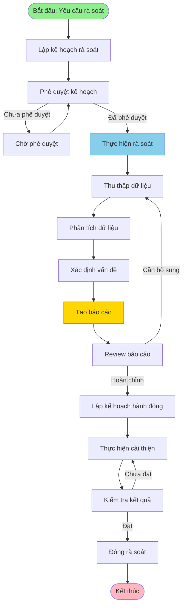

# QT-010: QUY TRÌNH RÀ SOÁT HỆ THỐNG KHI CẦN AUDIT

---

## THÔNG TIN TÀI LIỆU

- **Mã quy trình**: QT-010
- **Tên quy trình**: Quy trình Rà soát Hệ thống khi cần Audit
- **Phiên bản**: 1.0
- **Ngày ban hành**: [Ngày hiện tại]
- **Người soạn**: 
- **Trạng thái**: Chính thức

---

## MỤC LỤC

1. [Tổng quan](#1-tổng-quan)
2. [Quy trình rà soát](#2-quy-trình-rà-soát)
3. [Nội dung rà soát](#3-nội-dung-rà-soát)
4. [Tài liệu và báo cáo](#4-tài-liệu-và-báo-cáo)
5. [Xử lý phát hiện](#5-xử-lý-phát-hiện)
6. [Checklist](#6-checklist)

---

## 1. TỔNG QUAN

### 1.1. Mục đích

Quy trình rà soát hệ thống khi cần audit nhằm:
- **Đảm bảo tuân thủ**: Kiểm tra hệ thống có tuân thủ các chính sách, quy trình, tiêu chuẩn
- **Phát hiện vấn đề**: Phát hiện các vấn đề về bảo mật, tuân thủ, quy trình
- **Cải thiện liên tục**: Đề xuất cải thiện dựa trên kết quả rà soát
- **Chuẩn bị audit**: Chuẩn bị đầy đủ tài liệu và bằng chứng cho audit

### 1.2. Phạm vi

- Rà soát toàn bộ hệ thống CNTT
- Rà soát quy trình quản trị và vận hành
- Rà soát quyền truy cập và bảo mật
- Rà soát tuân thủ các tiêu chuẩn (ISO 27001, GDPR, SOC 2, PCI DSS)
- Rà soát tài liệu và ghi nhận

### 1.3. Đối tượng

- **IT/Security Team**: Thực hiện rà soát
- **IT Manager**: Phê duyệt kế hoạch rà soát
- **Ban CLGSP**: Phê duyệt kết quả rà soát
- **Auditor/Compliance**: Sử dụng kết quả rà soát
- **Lãnh đạo**: Xem xét kết quả rà soát

### 1.4. Tần suất rà soát

| Loại rà soát | Tần suất | Người thực hiện |
|--------------|----------|-----------------|
| **Rà soát quyền truy cập** | Hàng tháng | IT/Security Team |
| **Rà soát quy trình** | Hàng quý | IT Manager, Ban CLGSP |
| **Rà soát bảo mật** | Hàng quý | Security Team |
| **Rà soát tuân thủ** | Hàng năm | IT Manager, Ban CLGSP, Auditor |
| **Rà soát trước audit** | Khi có yêu cầu | IT/Security Team, Ban CLGSP |

---

## 2. QUY TRÌNH RÀ SOÁT

### 2.1. Quy trình tổng quan



### 2.2. Chi tiết từng bước

#### Bước 1: Lập kế hoạch rà soát

**Công việc**:
- [ ] Xác định mục đích rà soát
- [ ] Xác định phạm vi rà soát
- [ ] Xác định thời gian rà soát
- [ ] Xác định người thực hiện
- [ ] Xác định tài liệu cần thu thập
- [ ] Lập kế hoạch chi tiết

**Nội dung kế hoạch**:
- Mục đích rà soát
- Phạm vi rà soát (hệ thống, quy trình, thời gian)
- Thời gian thực hiện
- Người thực hiện
- Tài liệu cần thu thập
- Phương pháp rà soát

#### Bước 2: Phê duyệt kế hoạch

**Công việc**:
- [ ] Gửi kế hoạch cho IT Manager
- [ ] Gửi kế hoạch cho Ban CLGSP (nếu cần)
- [ ] Chờ phê duyệt
- [ ] Cập nhật kế hoạch theo phản hồi

**Cấp phê duyệt**:
- **Rà soát định kỳ**: IT Manager
- **Rà soát trước audit**: Ban CLGSP + IT Manager
- **Rà soát đặc biệt**: Lãnh đạo

#### Bước 3: Thực hiện rà soát

**Công việc**:
- [ ] Thu thập dữ liệu theo kế hoạch
- [ ] Phân tích dữ liệu
- [ ] Xác định vấn đề
- [ ] Đánh giá mức độ nghiêm trọng
- [ ] Ghi nhận kết quả

**Tham chiếu**: Phần 3 - Nội dung rà soát

#### Bước 4: Tạo báo cáo

**Công việc**:
- [ ] Tổng hợp kết quả rà soát
- [ ] Phân loại vấn đề
- [ ] Đánh giá mức độ nghiêm trọng
- [ ] Đề xuất cải thiện
- [ ] Tạo báo cáo chi tiết

**Tham chiếu**: Phần 4 - Tài liệu và báo cáo

#### Bước 5: Review và phê duyệt báo cáo

**Công việc**:
- [ ] Gửi báo cáo cho IT Manager
- [ ] Gửi báo cáo cho Ban CLGSP (nếu cần)
- [ ] Review báo cáo
- [ ] Cập nhật báo cáo theo phản hồi
- [ ] Phê duyệt báo cáo

#### Bước 6: Lập kế hoạch hành động

**Công việc**:
- [ ] Ưu tiên các vấn đề
- [ ] Lập kế hoạch khắc phục
- [ ] Xác định người chịu trách nhiệm
- [ ] Xác định thời hạn
- [ ] Phê duyệt kế hoạch

#### Bước 7: Thực hiện cải thiện

**Công việc**:
- [ ] Thực hiện các cải thiện theo kế hoạch
- [ ] Ghi nhận tiến độ
- [ ] Báo cáo tiến độ định kỳ
- [ ] Kiểm tra kết quả

#### Bước 8: Kiểm tra và đóng

**Công việc**:
- [ ] Kiểm tra kết quả cải thiện
- [ ] Xác nhận vấn đề đã được khắc phục
- [ ] Cập nhật tài liệu
- [ ] Đóng rà soát
- [ ] Lưu trữ tài liệu

---

## 3. NỘI DUNG RÀ SOÁT

### 3.1. Rà soát quyền truy cập

#### 3.1.1. Rà soát tài khoản

**Nội dung**:
- [ ] Danh sách tất cả tài khoản
- [ ] Tài khoản đang hoạt động
- [ ] Tài khoản không hoạt động
- [ ] Tài khoản có quyền admin
- [ ] Tài khoản service account
- [ ] Tài khoản của nhân viên đã nghỉ việc

**Tiêu chí đánh giá**:
- Tất cả tài khoản đều có owner rõ ràng
- Tài khoản không hoạt động đã được khóa
- Tài khoản của nhân viên nghỉ việc đã được thu hồi trong 24 giờ
- Tài khoản admin đã được rà soát định kỳ
- Service account không được sử dụng để đăng nhập

#### 3.1.2. Rà soát quyền

**Nội dung**:
- [ ] Quyền của từng tài khoản
- [ ] Quyền không được sử dụng
- [ ] Quyền tạm thời đã hết hạn
- [ ] Quyền không phù hợp với vai trò
- [ ] Quyền dư thừa

**Tiêu chí đánh giá**:
- Quyền phù hợp với vai trò (RBAC)
- Quyền không được sử dụng đã được thu hồi
- Quyền tạm thời đã hết hạn đã được thu hồi
- Không có quyền dư thừa
- Tuân thủ nguyên tắc Least Privilege

#### 3.1.3. Rà soát MFA

**Nội dung**:
- [ ] Tài khoản admin có MFA
- [ ] Tài khoản có quyền cao có MFA
- [ ] Tài khoản không có MFA nhưng cần có

**Tiêu chí đánh giá**:
- 100% tài khoản admin có MFA
- 100% tài khoản có quyền cao có MFA
- MFA được kích hoạt đúng cách

### 3.2. Rà soát quy trình

#### 3.2.1. Rà soát quy trình triển khai

**Nội dung**:
- [ ] Quy trình Upcode (QT-003)
- [ ] Quy trình Hotfix (QT-004)
- [ ] Quy trình Release (QT-007)
- [ ] Quy trình Provisioning (QT-005)

**Tiêu chí đánh giá**:
- Tất cả deployment đều có RFC
- Tất cả deployment đều được phê duyệt
- Tất cả deployment đều có test
- Tất cả deployment đều có rollback plan
- Tất cả deployment đều được ghi log

#### 3.2.2. Rà soát quy trình quản trị

**Nội dung**:
- [ ] Quy trình Quản trị Vận hành (QT-002)
- [ ] Quy trình cấp quyền
- [ ] Quy trình rà soát quyền
- [ ] Quy trình xử lý sự cố

**Tiêu chí đánh giá**:
- Quy trình được tuân thủ
- Tài liệu đầy đủ
- Ghi nhận đầy đủ
- Có checklist và template

### 3.3. Rà soát bảo mật

#### 3.3.1. Rà soát cấu hình bảo mật

**Nội dung**:
- [ ] Cấu hình firewall
- [ ] Cấu hình network
- [ ] Cấu hình server
- [ ] Cấu hình database
- [ ] Cấu hình cloud

**Tiêu chí đánh giá**:
- Cấu hình tuân thủ best practices
- Không có lỗ hổng bảo mật
- Encryption được sử dụng đúng cách
- Access control được cấu hình đúng

#### 3.3.2. Rà soát patch và update

**Nội dung**:
- [ ] Patch bảo mật đã được cài đặt
- [ ] Update hệ thống đã được thực hiện
- [ ] Vulnerability scan đã được thực hiện
- [ ] Security scan đã được thực hiện

**Tiêu chí đánh giá**:
- Tất cả patch bảo mật quan trọng đã được cài đặt
- Hệ thống đã được update lên phiên bản mới nhất (nếu có thể)
- Vulnerability scan được thực hiện định kỳ
- Security scan được thực hiện định kỳ

### 3.4. Rà soát tuân thủ

#### 3.4.1. Rà soát tuân thủ ISO 27001

**Nội dung**:
- [ ] Access control (A.9)
- [ ] Cryptography (A.10)
- [ ] Operations security (A.12)
- [ ] Communications security (A.13)
- [ ] System acquisition (A.14)
- [ ] Supplier relationships (A.15)
- [ ] Information security incident management (A.16)
- [ ] Business continuity (A.17)
- [ ] Compliance (A.18)

**Tiêu chí đánh giá**:
- Tuân thủ các control của ISO 27001
- Tài liệu đầy đủ
- Ghi nhận đầy đủ
- Có bằng chứng tuân thủ

#### 3.4.2. Rà soát tuân thủ GDPR

**Nội dung**:
- [ ] Quyền truy cập dữ liệu cá nhân
- [ ] Ghi log truy cập dữ liệu cá nhân
- [ ] Xóa dữ liệu cá nhân (Right to be forgotten)
- [ ] Báo cáo data breach

**Tiêu chí đánh giá**:
- Quyền truy cập dữ liệu cá nhân được kiểm soát
- Tất cả truy cập dữ liệu cá nhân đều được ghi log
- Có quy trình xóa dữ liệu cá nhân
- Có quy trình báo cáo data breach trong 72 giờ

#### 3.4.3. Rà soát tuân thủ SOC 2

**Nội dung**:
- [ ] Access controls
- [ ] Change management
- [ ] Monitoring
- [ ] Incident response

**Tiêu chí đánh giá**:
- Access controls được implement và monitor
- Changes được authorized
- Access reviews được thực hiện định kỳ
- Audit logs được maintain

### 3.5. Rà soát tài liệu

#### 3.5.1. Rà soát tài liệu quy trình

**Nội dung**:
- [ ] Tài liệu quy trình đầy đủ
- [ ] Tài liệu quy trình được cập nhật
- [ ] Tài liệu quy trình được tuân thủ

**Tiêu chí đánh giá**:
- Tất cả quy trình đều có tài liệu
- Tài liệu được cập nhật định kỳ
- Tài liệu phản ánh đúng quy trình thực tế

#### 3.5.2. Rà soát ghi nhận

**Nội dung**:
- [ ] Ghi nhận deployment
- [ ] Ghi nhận cấp quyền
- [ ] Ghi nhận sự cố
- [ ] Ghi nhận thay đổi

**Tiêu chí đánh giá**:
- Tất cả hoạt động quan trọng đều được ghi nhận
- Ghi nhận đầy đủ thông tin
- Ghi nhận được lưu trữ đúng cách
- Ghi nhận có thể truy vết

---

## 4. TÀI LIỆU VÀ BÁO CÁO

### 4.1. Báo cáo rà soát

#### 4.1.1. Cấu trúc báo cáo

**1. Tổng quan**
- Mục đích rà soát
- Phạm vi rà soát
- Thời gian rà soát
- Người thực hiện

**2. Phương pháp**
- Phương pháp thu thập dữ liệu
- Phương pháp phân tích
- Tiêu chí đánh giá

**3. Kết quả**
- Tổng hợp kết quả
- Phân loại vấn đề
- Đánh giá mức độ nghiêm trọng

**4. Phát hiện**
- Vấn đề phát hiện
- Mức độ nghiêm trọng
- Nguyên nhân
- Tác động

**5. Đề xuất**
- Đề xuất cải thiện
- Ưu tiên
- Thời hạn
- Người chịu trách nhiệm

**6. Kết luận**
- Tổng kết
- Đánh giá tổng thể
- Khuyến nghị

#### 4.1.2. Template báo cáo

**Tham chiếu**: 
- `Template (TP-XXX)/TP-007-TEMPLATE_BAO_CAO_RA_SOAT.md`
- `Template (TP-XXX)/TP-007-EXAMPLE_BAO_CAO_RA_SOAT.md`

### 4.2. Tài liệu hỗ trợ

#### 4.2.1. Tài liệu cần thu thập

**Quyền truy cập**:
- [ ] Danh sách tài khoản
- [ ] Danh sách quyền
- [ ] Lịch sử cấp quyền
- [ ] Lịch sử sử dụng quyền
- [ ] Audit log

**Quy trình**:
- [ ] RFC đã được tạo
- [ ] Checklist đã được sử dụng
- [ ] Template đã được điền
- [ ] Ghi nhận deployment
- [ ] Ghi nhận rollback

**Bảo mật**:
- [ ] Security scan report
- [ ] Vulnerability scan report
- [ ] Patch management report
- [ ] Incident report

**Tuân thủ**:
- [ ] Compliance report
- [ ] Audit trail
- [ ] Access review report
- [ ] Change log

### 4.3. Lưu trữ tài liệu

**Quy định**:
- Tài liệu được lưu trữ trong hệ thống quản lý tài liệu
- Tài liệu được backup định kỳ
- Tài liệu được lưu trữ ít nhất 7 năm (cho compliance)
- Tài liệu được bảo vệ bằng encryption

---

## 5. XỬ LÝ PHÁT HIỆN

### 5.1. Phân loại vấn đề

#### 5.1.1. Mức độ nghiêm trọng

| Mức độ | Mô tả | Thời gian xử lý | Người xử lý |
|--------|-------|-----------------|-------------|
| **Critical** | Rủi ro bảo mật nghiêm trọng, vi phạm compliance | Ngay lập tức | Security Team, IT Manager |
| **High** | Rủi ro bảo mật cao, vi phạm quy trình | 24 giờ | IT Team, Security Team |
| **Medium** | Rủi ro trung bình, không tuân thủ best practices | 7 ngày | IT Team |
| **Low** | Rủi ro thấp, cơ hội cải thiện | 30 ngày | IT Team |

#### 5.1.2. Phân loại vấn đề

**Bảo mật**:
- Lỗ hổng bảo mật
- Quyền truy cập không phù hợp
- MFA chưa được kích hoạt
- Encryption chưa được sử dụng

**Tuân thủ**:
- Vi phạm chính sách
- Vi phạm quy trình
- Thiếu tài liệu
- Thiếu ghi nhận

**Quy trình**:
- Không tuân thủ quy trình
- Thiếu checklist
- Thiếu template
- Thiếu phê duyệt

### 5.2. Quy trình xử lý

#### 5.2.1. Quy trình xử lý vấn đề

```
1. Phát hiện vấn đề
 ↓
2. Phân loại mức độ nghiêm trọng
 ↓
3. Tạo ticket/issue
 ↓
4. Assign người chịu trách nhiệm
 ↓
5. Lập kế hoạch khắc phục
 ↓
6. Thực hiện khắc phục
 ↓
7. Kiểm tra kết quả
 ↓
8. Đóng ticket/issue
```

#### 5.2.2. Kế hoạch hành động

**Nội dung**:
- Vấn đề phát hiện
- Mức độ nghiêm trọng
- Nguyên nhân
- Tác động
- Kế hoạch khắc phục
- Người chịu trách nhiệm
- Thời hạn
- Trạng thái

**Template**: 
- `Template (TP-XXX)/TP-008-TEMPLATE_KE_HOACH_HANH_DONG.md`
- `Template (TP-XXX)/TP-008-EXAMPLE_KE_HOACH_HANH_DONG.md`

### 5.3. Theo dõi và báo cáo

#### 5.3.1. Theo dõi tiến độ

**Công việc**:
- [ ] Theo dõi tiến độ khắc phục
- [ ] Báo cáo tiến độ định kỳ
- [ ] Escalate nếu chậm trễ
- [ ] Đánh giá kết quả

**Tần suất báo cáo**:
- **Critical**: Hàng ngày
- **High**: Hàng tuần
- **Medium**: Hàng tháng
- **Low**: Hàng quý

#### 5.3.2. Báo cáo kết quả

**Nội dung**:
- Tổng hợp vấn đề phát hiện
- Tiến độ khắc phục
- Kết quả khắc phục
- Vấn đề còn tồn đọng
- Đề xuất cải thiện

---

## 6. CHECKLIST

### 6.1. Checklist trước rà soát

- [ ] Kế hoạch rà soát đã được lập
- [ ] Kế hoạch rà soát đã được phê duyệt
- [ ] Người thực hiện đã được xác định
- [ ] Tài liệu cần thu thập đã được xác định
- [ ] Phương pháp rà soát đã được xác định
- [ ] Thời gian rà soát đã được xác định

### 6.2. Checklist trong rà soát

- [ ] Dữ liệu đã được thu thập đầy đủ
- [ ] Dữ liệu đã được phân tích
- [ ] Vấn đề đã được xác định
- [ ] Mức độ nghiêm trọng đã được đánh giá
- [ ] Kết quả đã được ghi nhận

### 6.3. Checklist sau rà soát

- [ ] Báo cáo rà soát đã được tạo
- [ ] Báo cáo đã được review
- [ ] Báo cáo đã được phê duyệt
- [ ] Kế hoạch hành động đã được lập
- [ ] Kế hoạch hành động đã được phê duyệt
- [ ] Tài liệu đã được lưu trữ

---

## PHỤ LỤC

### A. Tham chiếu

- **README.md**: File chính, tổng quan hệ thống
- **QT-002**: Quy trình Quản trị Vận hành
- **QT-003**: Quy trình Upcode
- **CHÍNH SÁCH QUYỀN TRUY CẬP TỐI THIỂU**: Chính sách quyền truy cập
- **CL-012**: Checklist Rà soát Hệ thống
- **TP-007**: Template Báo cáo Rà soát
- **TP-008**: Template Kế hoạch Hành động

### B. Thuật ngữ

- **Audit**: Kiểm toán, rà soát hệ thống
- **Compliance**: Tuân thủ
- **ISO 27001**: Tiêu chuẩn quốc tế về quản lý an toàn thông tin
- **GDPR**: General Data Protection Regulation
- **SOC 2**: System and Organization Controls 2
- **PCI DSS**: Payment Card Industry Data Security Standard

---

**Phiên bản**: 1.0 
**Ngày ban hành**: [Ngày hiện tại] 
**Người soạn**: 
**Trạng thái**: Chính thức
